# Money vs winning: the 2026 college football season

_Generated 2026-09-14 20:12. Season 2026, through week 3; teams have played 1-3 games._

> [!WARNING]
> Sample-size warning: this is an in-progress season. Two or three games per team is not enough to separate skill from luck. Treat every coefficient below as directional until November.

## What is being measured

| Side | Source | Vintage |
| --- | --- | --- |
| Results, scores, stats | ESPN public API | live, 2026 |
| Football revenue/expenses, department revenue, average coach salaries | US Dept of Education EADA filings | report year 2025 |
| Head coach total pay | hand-compiled, per-row citations | 2026 |
| Revenue-share cap, roster payroll, team talent | House settlement reporting, 247Sports | 2026 |

> [!NOTE]
> Federal athletics finances are published on a lag, so the 2025 filings (academic year 2024-25) are the newest available. That is a feature here rather than a bug: past spending is a *leading* indicator of present results, so the direction of causation runs the right way.

## The richest programs and what they have done so far

| # | Program | Conf | Football rev | Football exp | Dept rev | Record | Win% | Margin/g |
| ---: | --- | --- | ---: | ---: | ---: | :---: | ---: | ---: |
| 1 | Notre Dame | FBS Independents | $195.7M | $93.3M | $289.6M | 2-0 | 100.0% | +40.0 |
| 2 | Michigan | Big Ten | $175.3M | $61.7M | $236.4M | 2-0 | 100.0% | +4.0 |
| 3 | Texas | SEC | $171.9M | $70.4M | $343.1M | 2-0 | 100.0% | +26.5 |
| 4 | Tennessee | SEC | $162.5M | $61.2M | $285.4M | 2-0 | 100.0% | +34.0 |
| 5 | Ohio State | Big Ten | $160.5M | $92.4M | $295.3M | 1-1 | 50.0% | +26.0 |
| 6 | Penn State | Big Ten | $150.3M | $77.4M | $254.4M | 2-0 | 100.0% | +31.5 |
| 7 | Georgia | SEC | $149.3M | $71.1M | $233.5M | 2-0 | 100.0% | +55.0 |
| 8 | Alabama | SEC | $146.3M | $81.5M | $244.6M | 2-0 | 100.0% | +33.0 |
| 9 | Oklahoma | SEC | $126.2M | $71.2M | $234.4M | 1-1 | 50.0% | +22.0 |
| 10 | Nebraska | Big Ten | $122.3M | $70.6M | $205.8M | 2-0 | 100.0% | +38.5 |
| 11 | Auburn | SEC | $121.4M | $58.7M | $205.3M | 2-0 | 100.0% | +18.0 |
| 12 | Washington | Big Ten | $121.0M | $68.9M | $178.4M | 2-0 | 100.0% | +8.0 |
| 13 | Oregon | Big Ten | $119.6M | $60.8M | $167.1M | 1-1 | 50.0% | -0.5 |
| 14 | LSU | SEC | $117.6M | $50.7M | $223.5M | 2-0 | 100.0% | +36.0 |
| 15 | Florida | SEC | $113.4M | $51.8M | $199.2M | 2-0 | 100.0% | +47.0 |
| 16 | Wisconsin | Big Ten | $112.3M | $40.9M | $190.5M | 1-1 | 50.0% | -0.5 |
| 17 | Texas A&M | SEC | $108.5M | $60.2M | $235.5M | 2-0 | 100.0% | +39.0 |
| 18 | Iowa | Big Ten | $105.2M | $50.9M | $180.0M | 2-0 | 100.0% | +21.5 |
| 19 | Minnesota | Big Ten | $101.7M | $45.5M | $156.8M | 1-1 | 50.0% | +13.5 |
| 20 | Miami | ACC | $99.9M | $88.1M | $230.5M | 2-0 | 100.0% | +54.5 |

## Spending versus revenue: which one tracks winning?

Revenue is money **coming in**; expenses are money **going out**. They are not the same question:

- Revenue is partly a *reward* for winning - ticket sales, donations and playoff payouts all follow success. A high correlation there is partly reverse causation.
- Spending is closer to an *input*: what the program chose to pay for coaches, staff, recruiting and running the team.

In practice the two move together: the correlation between log revenue and log spending is **0.96**. Rich programs spend more, so neither variable can fully be untangled from the other - but the ranking below shows which one tracks results more closely.

| Money metric | In/Out | Performance metric | n | r | R² |
| --- | :---: | --- | ---: | ---: | ---: |
| Athletics dept revenue | IN | point margin per game | 135 | +0.498 | 0.248 |
| Athletics dept expenses | OUT | point margin per game | 135 | +0.495 | 0.245 |
| Men's coaching payroll | OUT | point margin per game | 135 | +0.487 | 0.237 |
| 247 team talent composite | OUT | points per game | 19 | +0.482 | 0.233 |
| Men's coaching payroll | OUT | win pct | 135 | +0.479 | 0.230 |
| Football coaching payroll (est) | OUT | point margin per game | 135 | +0.476 | 0.227 |
| Athletics dept expenses | OUT | win pct | 135 | +0.475 | 0.225 |
| Athletics dept revenue | IN | win pct | 135 | +0.474 | 0.225 |
| Football revenue | IN | point margin per game | 135 | +0.464 | 0.215 |
| Men's recruiting spend | OUT | point margin per game | 135 | +0.461 | 0.213 |
| Football expenses | OUT | point margin per game | 135 | +0.460 | 0.212 |
| Football coaching payroll (est) | OUT | win pct | 135 | +0.460 | 0.212 |
| Football non-operating spend | OUT | point margin per game | 135 | +0.459 | 0.211 |
| Football spend per player | OUT | point margin per game | 135 | +0.456 | 0.208 |

## The same question across four seasons

A three-game sample cannot settle anything, so the table below repeats the headline correlation on completed seasons. The in-progress season is marked.

| Season | Teams | r (log football revenue vs win%) | R² |
| ---: | ---: | ---: | ---: |
| 2023 | 130 | +0.367 | 0.135 |
| 2024 | 131 | +0.397 | 0.158 |
| 2025 | 133 | +0.298 | 0.089 |
| 2026 (in progress) | 135 | +0.446 | 0.199 |

## What happened to the schools that switched conference

Between 2023 and 2026 the sport redrew its map: **24 schools changed conference**. That is the closest thing this data has to a controlled experiment, because the money moved for reasons that had nothing to do with how well any given team was playing.

> [!IMPORTANT]
> The federal finance filings lag the field by two years, so the newest money year available is the 2024 season. Schools that moved in 2024 therefore have exactly **one** post-move budget year on record, and schools that moved in 2026 have **none**. Their money columns are intentionally blank rather than filled with stale pre-move values.

### The Pac-12 breakup

Ten of the twelve 2023 Pac-12 members left. Two did not, and the gap between those two groups is the single starkest result in this project.

| School | Role | Football revenue before | After | Change | Point margin change |
| --- | --- | ---: | ---: | ---: | ---: |
| Arizona | left | $37.1M | $37.8M | +1.8% | -9.4 |
| Arizona State | left | $40.2M | $50.4M | +25.4% | +24.4 |
| California | left | $45.1M | $64.0M | +41.9% | -1.2 |
| Colorado | left | $64.7M | $69.3M | +7.2% | +13.0 |
| Oregon | left | $109.2M | $119.6M | +9.5% | -13.2 |
| Stanford | left | $33.7M | $36.0M | +6.7% | +5.2 |
| UCLA | left | $45.8M | $55.2M | +20.6% | -8.5 |
| USC | left | $74.9M | $74.0M | -1.1% | +8.1 |
| Utah | left | $72.8M | $95.9M | +31.8% | +17.9 |
| Washington | left | $127.8M | $121.0M | -5.3% | -6.7 |
| Oregon State | stayed behind | $47.4M | $32.6M | -31.2% | -22.0 |
| Washington State | stayed behind | $57.0M | $38.8M | -31.9% | -7.1 |
| Boise State | joined new Pac-12 | $41.1M | - | n/a | -5.7 |
| Colorado State | joined new Pac-12 | $19.6M | - | n/a | +33.1 |
| Fresno State | joined new Pac-12 | $18.3M | - | n/a | -1.1 |
| San Diego State | joined new Pac-12 | $27.5M | - | n/a | +8.3 |
| Texas State | joined new Pac-12 | $18.0M | - | n/a | -35.3 |
| Utah State | joined new Pac-12 | $17.4M | - | n/a | -6.3 |

Median revenue change for the schools that left: **+8.3%**. For the two left behind: **-31.6%**. Washington State and Oregon State did nothing differently on the field; they simply lost their conference, and roughly a third of their football revenue went with it.

> [!NOTE]
> The leavers gained less than the headline media deals imply because several joined on **reduced shares**. Oregon and Washington entered the Big Ten at a reported ~$30M annual share against a full share of $65M+, escalating roughly $1M a year until they phase in near the end of the decade. That is why their measured revenue change here is single digit or even negative while UCLA and California, which did not take the same discount, moved much more. See research_notes_2026.md for the sourcing.

### Every school that moved

| School | Move | Effective | Revenue change | Point margin change |
| --- | --- | ---: | ---: | ---: |
| Arizona | Pac-12 to Big 12 | 2024 | +1.8% | -9.4 |
| Arizona State | Pac-12 to Big 12 | 2024 | +25.4% | +24.4 |
| Army | FBS Independents to American | 2024 | not yet filed | +14.4 |
| California | Pac-12 to ACC | 2024 | +41.9% | -1.2 |
| Colorado | Pac-12 to Big 12 | 2024 | +7.2% | +13.0 |
| Oklahoma | Big 12 to SEC | 2024 | +1.1% | -8.5 |
| Oregon | Pac-12 to Big Ten | 2024 | +9.5% | -13.2 |
| SMU | American to ACC | 2024 | +41.8% | -5.1 |
| Stanford | Pac-12 to ACC | 2024 | +6.7% | +5.2 |
| Texas | Big 12 to SEC | 2024 | -14.4% | +0.5 |
| UCLA | Pac-12 to Big Ten | 2024 | +20.6% | -8.5 |
| USC | Pac-12 to Big Ten | 2024 | -1.1% | +8.1 |
| Utah | Pac-12 to Big 12 | 2024 | +31.8% | +17.9 |
| Washington | Pac-12 to Big Ten | 2024 | -5.3% | -6.7 |
| Massachusetts | FBS Independents to MAC | 2025 | not yet filed | +10.8 |
| Boise State | Mountain West to Pac-12 | 2026 | not yet filed | -5.7 |
| Colorado State | Mountain West to Pac-12 | 2026 | not yet filed | +33.1 |
| Fresno State | Mountain West to Pac-12 | 2026 | not yet filed | -1.1 |
| Louisiana Tech | Conference USA to Sun Belt | 2026 | not yet filed | +21.3 |
| Northern Illinois | MAC to Mountain West | 2026 | not yet filed | -22.9 |
| San Diego State | Mountain West to Pac-12 | 2026 | not yet filed | +8.3 |
| Texas State | Sun Belt to Pac-12 | 2026 | not yet filed | -35.3 |
| UTEP | Conference USA to Mountain West | 2026 | not yet filed | +4.5 |
| Utah State | Mountain West to Pac-12 | 2026 | not yet filed | -6.3 |

## What the head coach is paid

Verified total pay is on file for **57 of 138 teams**. Private universities are exempt from public-records law, so the missing rows are not missing at random: they skew private and wealthy. Read this section as suggestive.

Across those 57 teams, head coach pay correlates **r = +0.27** with point margin per game (p = 0.045). That is a real but much weaker signal than total program spending, which is the more telling result: paying one person more matters far less than the scale of the operation behind them.

| Coach | School | Total pay | Win% | Point margin |
| --- | --- | ---: | ---: | ---: |
| Kirby Smart | Georgia | $13.3M | 1.000 | +55.0 |
| Ryan Day | Ohio State | $12.6M | 0.500 | +26.0 |
| Dabo Swinney | Clemson | $11.4M | 0.500 | -13.0 |
| Steve Sarkisian | Texas | $10.8M | 1.000 | +26.5 |
| Dan Lanning | Oregon | $10.4M | 0.500 | -0.5 |
| Kalen DeBoer | Alabama | $10.2M | 1.000 | +33.0 |
| Brian Kelly | LSU | $10.2M | 1.000 | +36.0 |
| Bill Belichick | North Carolina | $10.1M | 1.000 | +18.5 |
| Josh Heupel | Tennessee | $9.0M | 1.000 | +34.0 |
| Eliah Drinkwitz | Missouri | $9.0M | 1.000 | +28.5 |

## Travel, time zones and the cost of flying east

Realignment moved miles as well as money. A team flying east loses hours: a noon kickoff on the east coast is a 9am body clock for a team from California. The table below pools every completed game from 2023 to 2026 by how many time zones the team crossed.

| Travel | Games | Mean margin | Win rate |
| --- | ---: | ---: | ---: |
| 3 zones west | 51 | -3.0 | 41% |
| 2 zones west | 67 | -7.5 | 42% |
| 1 zone west | 362 | -6.2 | 35% |
| same zone | 1249 | -5.3 | 41% |
| 1 zone east | 358 | -3.2 | 42% |
| 2 zones east | 74 | -8.6 | 38% |
| 3 zones east | 51 | -7.8 | 35% |

> [!IMPORTANT]
> The raw split above is confounded. The teams that fly two or more zones east are disproportionately Group of Five programs taking a paycheque game at a blue blood, so they would have lost anyway. Comparing each team against **itself** - its own margin on long eastward trips versus its own margin on every other away game - the penalty is **-2.1 points** across 58 team-seasons (-6.3 on long eastward trips versus -4.2 on other away games).

### Who now travels further

Average time zones crossed per away game, before and after the move. The old Pac-12 fit inside two zones; the Big Ten and ACC do not.

| School | Move | Zones before | Zones after | Change | Away margin change |
| --- | --- | ---: | ---: | ---: | ---: |
| Stanford | Pac-12 to ACC | -0.20 | +1.83 | +2.03 | -4.1 |
| Arizona State | Pac-12 to Big 12 | -0.75 | +0.83 | +1.58 | +15.5 |
| California | Pac-12 to ACC | +0.50 | +2.08 | +1.58 | -2.0 |
| Colorado | Pac-12 to Big 12 | -0.33 | +1.00 | +1.33 | +11.8 |
| UCLA | Pac-12 to Big Ten | +0.33 | +1.46 | +1.13 | -14.9 |
| Washington | Pac-12 to Big Ten | +0.80 | +1.90 | +1.10 | -16.9 |
| Arizona | Pac-12 to Big 12 | -0.33 | +0.73 | +1.06 | -18.8 |
| Oregon | Pac-12 to Big Ten | +0.80 | +1.82 | +1.02 | -3.7 |
| Utah | Pac-12 to Big 12 | -0.40 | +0.58 | +0.98 | +17.5 |
| USC | Pac-12 to Big Ten | +1.00 | +1.80 | +0.80 | +1.3 |
| Texas | Big 12 to SEC | +0.00 | +0.56 | +0.56 | -11.1 |

## Every money metric against every performance metric

| Money metric | Performance metric | n | Pearson r | R² | Spearman ρ | p |
| --- | --- | ---: | ---: | ---: | ---: | ---: |
| Athletics dept revenue (log) | point margin per game | 135 | +0.498 | 0.248 | +0.474 | 0.0000*** |
| Athletics dept expenses (log) | point margin per game | 135 | +0.495 | 0.245 | +0.468 | 0.0000*** |
| Men's coaching payroll (log) | point margin per game | 135 | +0.487 | 0.237 | +0.474 | 0.0000*** |
| 247 team talent composite | points per game | 19 | +0.482 | 0.233 | +0.467 | 0.0365* |
| Men's coaching payroll (log) | win pct | 135 | +0.479 | 0.230 | +0.507 | 0.0000*** |
| Football coaching payroll (est) (log) | point margin per game | 135 | +0.476 | 0.227 | +0.489 | 0.0000*** |
| Athletics dept expenses (log) | win pct | 135 | +0.475 | 0.225 | +0.476 | 0.0000*** |
| Athletics dept revenue (log) | win pct | 135 | +0.474 | 0.225 | +0.480 | 0.0000*** |
| Athletics dept revenue (log) | points allowed per game | 135 | -0.470 | 0.221 | -0.448 | 0.0000*** |
| Athletics dept expenses (log) | points allowed per game | 135 | -0.466 | 0.217 | -0.441 | 0.0000*** |
| Football revenue (log) | point margin per game | 135 | +0.464 | 0.215 | +0.461 | 0.0000*** |
| Men's recruiting spend (log) | point margin per game | 135 | +0.461 | 0.213 | +0.460 | 0.0000*** |
| Football expenses (log) | point margin per game | 135 | +0.460 | 0.212 | +0.456 | 0.0000*** |
| Football coaching payroll (est) (log) | win pct | 135 | +0.460 | 0.212 | +0.490 | 0.0000*** |
| Football non-operating spend (log) | point margin per game | 135 | +0.459 | 0.211 | +0.455 | 0.0000*** |
| Football spend per player (log) | point margin per game | 135 | +0.456 | 0.208 | +0.454 | 0.0000*** |
| Men's coaching payroll (log) | points allowed per game | 135 | -0.452 | 0.204 | -0.429 | 0.0000*** |
| Men's recruiting spend (log) | win pct | 135 | +0.449 | 0.202 | +0.448 | 0.0000*** |
| Football revenue (log) | win pct | 135 | +0.446 | 0.199 | +0.464 | 0.0000*** |
| Football revenue (log) | points allowed per game | 135 | -0.446 | 0.199 | -0.444 | 0.0000*** |
| Football non-operating spend (log) | points allowed per game | 135 | -0.441 | 0.195 | -0.430 | 0.0000*** |
| Football coaching payroll (est) (log) | points allowed per game | 135 | -0.441 | 0.194 | -0.433 | 0.0000*** |
| Football expenses (log) | points allowed per game | 135 | -0.439 | 0.193 | -0.434 | 0.0000*** |
| Football spend per player (log) | win pct | 135 | +0.437 | 0.191 | +0.459 | 0.0000*** |
| Football expenses (log) | win pct | 135 | +0.435 | 0.189 | +0.450 | 0.0000*** |
| Football spend per player (log) | points allowed per game | 135 | -0.434 | 0.188 | -0.433 | 0.0000*** |
| Avg men's head coach salary (log) | point margin per game | 135 | +0.433 | 0.188 | +0.449 | 0.0000*** |
| Football non-operating spend (log) | win pct | 135 | +0.433 | 0.188 | +0.450 | 0.0000*** |
| Athletics dept revenue (log) | points per game | 135 | +0.424 | 0.180 | +0.389 | 0.0000*** |
| Athletics dept expenses (log) | points per game | 135 | +0.423 | 0.179 | +0.385 | 0.0000*** |
| Men's coaching payroll (log) | points per game | 135 | +0.421 | 0.177 | +0.399 | 0.0000*** |
| Men's recruiting spend (log) | points allowed per game | 135 | -0.416 | 0.173 | -0.419 | 0.0000*** |
| Football coaching payroll (est) (log) | points per game | 135 | +0.413 | 0.171 | +0.423 | 0.0000*** |
| Men's recruiting spend (log) | points per game | 135 | +0.409 | 0.167 | +0.387 | 0.0000*** |
| Avg men's head coach salary (log) | win pct | 135 | +0.401 | 0.161 | +0.427 | 0.0000*** |
| Avg men's head coach salary (log) | points per game | 135 | +0.396 | 0.156 | +0.402 | 0.0000*** |
| Football revenue (log) | points per game | 135 | +0.389 | 0.151 | +0.375 | 0.0000*** |
| Football expenses (log) | points per game | 135 | +0.389 | 0.151 | +0.373 | 0.0000*** |
| Football spend per player (log) | points per game | 135 | +0.385 | 0.149 | +0.370 | 0.0000*** |
| Football non-operating spend (log) | points per game | 135 | +0.385 | 0.148 | +0.370 | 0.0000*** |
| Avg men's head coach salary (log) | points allowed per game | 135 | -0.376 | 0.142 | -0.375 | 0.0000*** |
| 247 team talent composite | point margin per game | 19 | +0.328 | 0.108 | +0.370 | 0.1705 |
| Football coaching payroll (est) (log) | opponent win pct | 134 | -0.276 | 0.076 | -0.264 | 0.0012** |
| Head coach total pay (log) | point margin per game | 57 | +0.267 | 0.071 | +0.178 | 0.0449* |
| Head coach total pay (log) | points allowed per game | 57 | -0.265 | 0.070 | -0.158 | 0.0463* |
| Head coach total pay (log) | win pct | 57 | +0.262 | 0.069 | +0.191 | 0.0485* |
| Men's coaching payroll (log) | opponent win pct | 134 | -0.247 | 0.061 | -0.251 | 0.0040** |
| Football revenue (log) | opponent win pct | 134 | -0.245 | 0.060 | -0.256 | 0.0043** |
| Head coach total pay (log) | opponent win pct | 57 | -0.236 | 0.056 | -0.263 | 0.0771 |
| Avg men's head coach salary (log) | opponent win pct | 134 | -0.233 | 0.054 | -0.221 | 0.0067** |
| Athletics dept revenue (log) | opponent win pct | 134 | -0.228 | 0.052 | -0.240 | 0.0080** |
| Athletics dept expenses (log) | opponent win pct | 134 | -0.225 | 0.051 | -0.236 | 0.0090** |
| Football expenses (log) | opponent win pct | 134 | -0.221 | 0.049 | -0.238 | 0.0104* |
| Football coaching payroll (est) (log) | yards per carry | 135 | +0.216 | 0.047 | +0.175 | 0.0119* |
| Football non-operating spend (log) | opponent win pct | 134 | -0.215 | 0.046 | -0.225 | 0.0125* |
| Head coach total pay (log) | points per game | 57 | +0.208 | 0.043 | +0.152 | 0.1211 |
| Football spend per player (log) | opponent win pct | 134 | -0.205 | 0.042 | -0.221 | 0.0172* |
| Men's recruiting spend (log) | opponent win pct | 134 | -0.198 | 0.039 | -0.196 | 0.0220* |
| Athletics dept expenses (log) | yards per carry | 135 | +0.193 | 0.037 | +0.139 | 0.0253* |
| Men's coaching payroll (log) | yards per carry | 135 | +0.191 | 0.036 | +0.138 | 0.0267* |
| Athletics dept revenue (log) | yards per carry | 135 | +0.190 | 0.036 | +0.142 | 0.0274* |
| Football non-operating spend (log) | yards per carry | 135 | +0.187 | 0.035 | +0.148 | 0.0301* |
| Men's recruiting spend (log) | yards per carry | 135 | +0.186 | 0.034 | +0.108 | 0.0311* |
| 247 team talent composite | yards per carry | 19 | +0.176 | 0.031 | +0.107 | 0.4719 |
| Football expenses (log) | yards per carry | 135 | +0.175 | 0.031 | +0.138 | 0.0423* |
| Avg men's head coach salary (log) | yards per carry | 135 | +0.171 | 0.029 | +0.131 | 0.0473* |
| Football spend per player (log) | yards per carry | 135 | +0.171 | 0.029 | +0.126 | 0.0477* |
| Football revenue (log) | yards per carry | 135 | +0.162 | 0.026 | +0.146 | 0.0612 |
| 247 team talent composite | opponent win pct | 19 | -0.132 | 0.017 | -0.214 | 0.5912 |
| 247 team talent composite | points allowed per game | 19 | +0.115 | 0.013 | +0.099 | 0.6401 |
| 247 team talent composite | win pct | 19 | +0.082 | 0.007 | +0.131 | 0.7394 |
| Head coach total pay (log) | yards per carry | 57 | +0.038 | 0.001 | -0.061 | 0.7809 |

`*` p<0.05, `**` p<0.01, `***` p<0.001

## Regression: money with conference fixed effects

Conference dummies absorb the media-rights advantage, so the money coefficient answers a narrower question: *within the same league, does the bigger budget win more?*

Outcome: **win_pct**, predictor: **football_revenue**, n = 135, R² = 0.295 (adjusted 0.232).

| Term | Estimate | Std error | t | p |
| --- | ---: | ---: | ---: | ---: |
| intercept | -1.0420 | 1.2455 | -0.84 | 0.4044 |
| log10(football_revenue) | +0.2248 | 0.1600 | +1.41 | 0.1624 |
| conf[American] | -0.0408 | 0.1317 | -0.31 | 0.7572 |
| conf[Big 12] | +0.0690 | 0.0997 | +0.69 | 0.4904 |
| conf[Big Ten] | +0.0233 | 0.1014 | +0.23 | 0.8184 |
| conf[Conference USA] | -0.1820 | 0.1585 | -1.15 | 0.2532 |
| conf[FBS Independents] | +0.0381 | 0.2106 | +0.18 | 0.8566 |
| conf[MAC] | -0.0652 | 0.1574 | -0.41 | 0.6793 |
| conf[Mountain West] | -0.0260 | 0.1543 | -0.17 | 0.8666 |
| conf[Pac-12] | -0.3142 | 0.1333 | -2.36 | 0.0200* |
| conf[SEC] | +0.1566 | 0.1030 | +1.52 | 0.1308 |
| conf[Sun Belt] | +0.0519 | 0.1477 | +0.35 | 0.7259 |

### Overperformers and underperformers

**Beating their budget**

| Program | Conf | Football rev | Actual | Budget-predicted | Gap |
| --- | --- | ---: | ---: | ---: | ---: |
| Colorado State | Pac-12 | $21.0M | 100.0% | 29.0% | +71.0 pts |
| North Dakota State | Mountain West | $8.4M | 100.0% | 48.8% | +51.2 pts |
| Massachusetts | MAC | $13.4M | 100.0% | 49.5% | +50.5 pts |
| New Mexico | Mountain West | $15.3M | 100.0% | 54.7% | +45.3 pts |
| UTSA | American | $17.9M | 100.0% | 54.7% | +45.3 pts |
| Tulsa | American | $20.7M | 100.0% | 56.2% | +43.8 pts |
| Georgia State | Sun Belt | $12.3M | 100.0% | 60.3% | +39.7 pts |
| Troy | Sun Belt | $12.6M | 100.0% | 60.6% | +39.4 pts |
| South Florida | American | $33.4M | 100.0% | 60.8% | +39.2 pts |
| App State | Sun Belt | $13.3M | 100.0% | 61.1% | +38.9 pts |
| James Madison | Sun Belt | $16.9M | 100.0% | 63.5% | +36.5 pts |
| Wake Forest | ACC | $39.4M | 100.0% | 66.6% | +33.4 pts |

**Falling short of their budget**

| Program | Conf | Football rev | Actual | Budget-predicted | Gap |
| --- | --- | ---: | ---: | ---: | ---: |
| Rutgers | Big Ten | $75.9M | 0.0% | 75.3% | -75.3 pts |
| Georgia Tech | ACC | $70.5M | 0.0% | 72.2% | -72.2 pts |
| UL Monroe | Sun Belt | $7.8M | 0.0% | 55.9% | -55.9 pts |
| East Carolina | American | $16.5M | 0.0% | 54.0% | -54.0 pts |
| Northern Illinois | Mountain West | $13.2M | 0.0% | 53.3% | -53.3 pts |
| Charlotte | American | $11.9M | 0.0% | 50.8% | -50.8 pts |
| Bowling Green | MAC | $10.8M | 0.0% | 47.4% | -47.4 pts |
| Oklahoma | SEC | $126.2M | 50.0% | 93.6% | -43.6 pts |
| Arkansas | SEC | $90.8M | 50.0% | 90.4% | -40.4 pts |
| Western Kentucky | Conference USA | $11.0M | 0.0% | 35.9% | -35.9 pts |
| Washington State | Pac-12 | $38.8M | 0.0% | 35.0% | -35.0 pts |
| Sam Houston | Conference USA | $9.7M | 0.0% | 34.7% | -34.7 pts |

## Conference summary

| Conference | Teams | Median football rev | Median dept rev | Mean win% | Mean margin |
| --- | ---: | ---: | ---: | ---: | ---: |
| SEC | 16 | $110.9M | $204.9M | 90.6% | +28.0 |
| FBS Independents | 2 | $108.1M | $193.3M | 75.0% | +26.2 |
| Big Ten | 18 | $94.8M | $176.5M | 77.8% | +17.6 |
| ACC | 17 | $64.0M | $151.6M | 70.6% | +15.3 |
| Big 12 | 16 | $49.0M | $130.7M | 75.0% | +24.1 |
| Pac-12 | 8 | $23.1M | $72.8M | 31.2% | -2.9 |
| American | 14 | $19.5M | $62.8M | 54.8% | -0.3 |
| Mountain West | 10 | $13.2M | $50.4M | 53.3% | +4.7 |
| Sun Belt | 14 | $12.9M | $39.9M | 60.7% | +10.4 |
| Conference USA | 10 | $11.6M | $38.5M | 36.7% | -0.8 |
| MAC | 13 | $11.0M | $38.9M | 47.4% | -2.9 |

## Figures

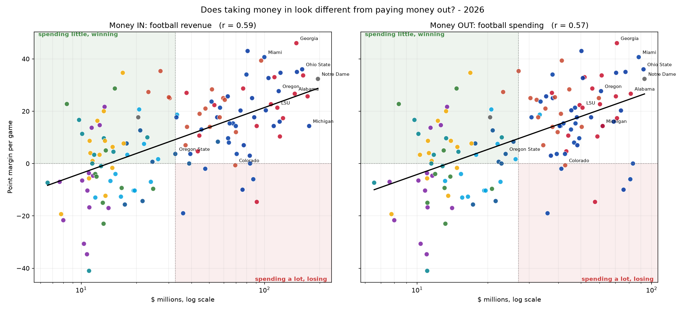

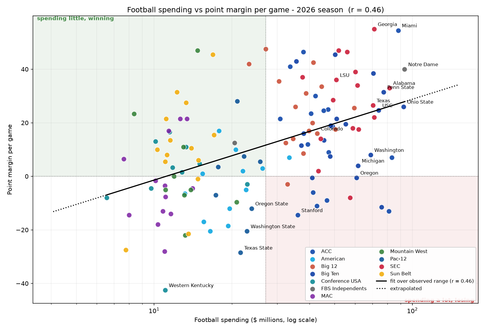

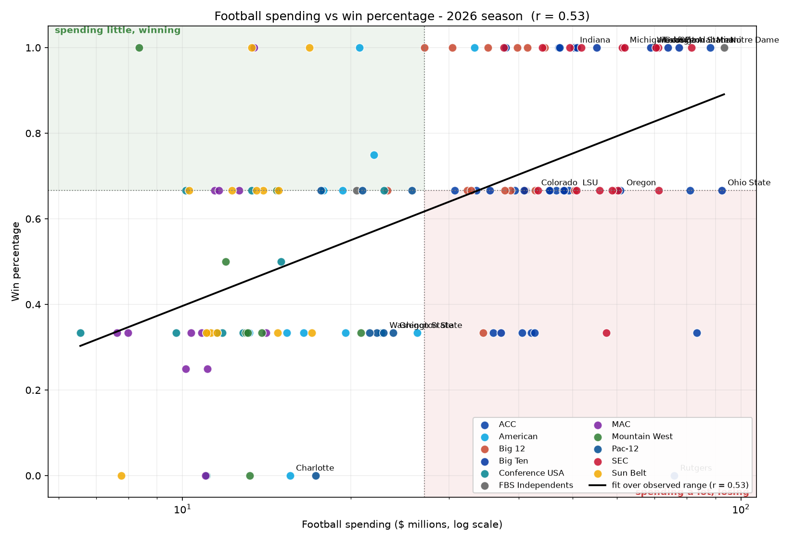

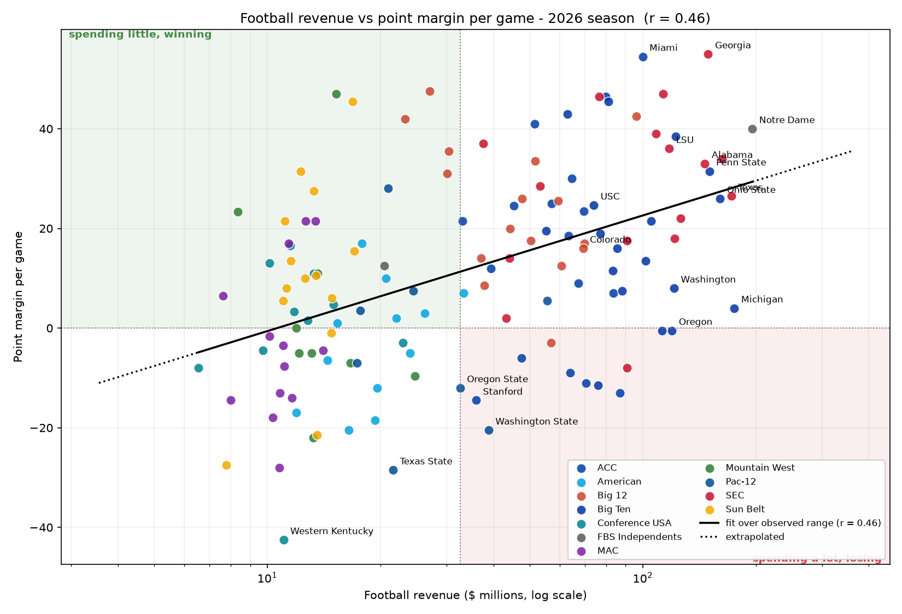

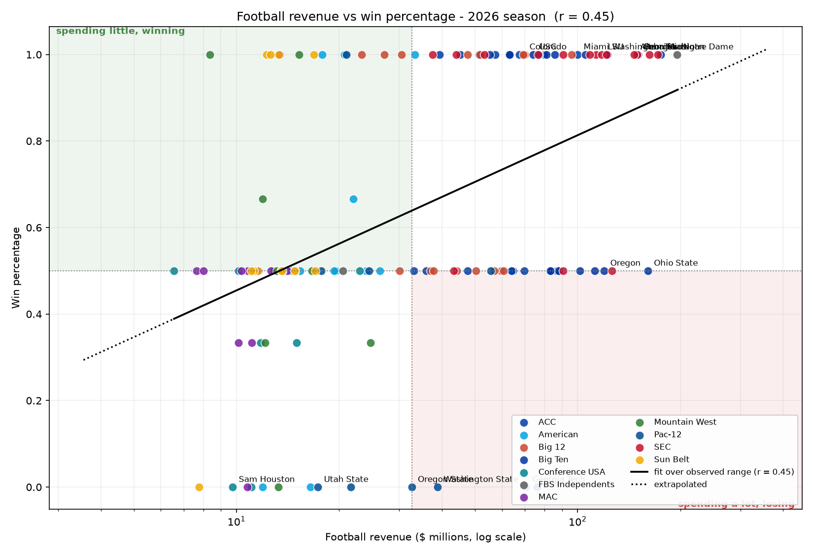

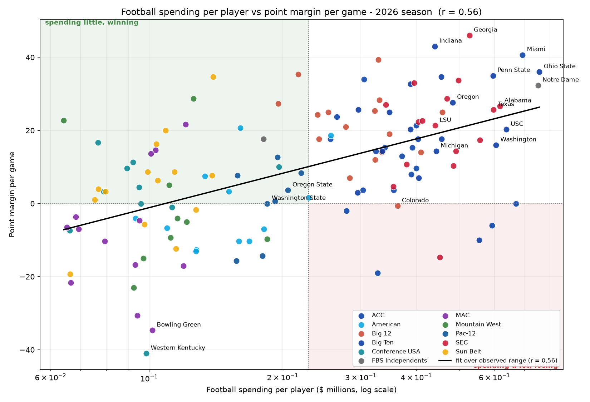

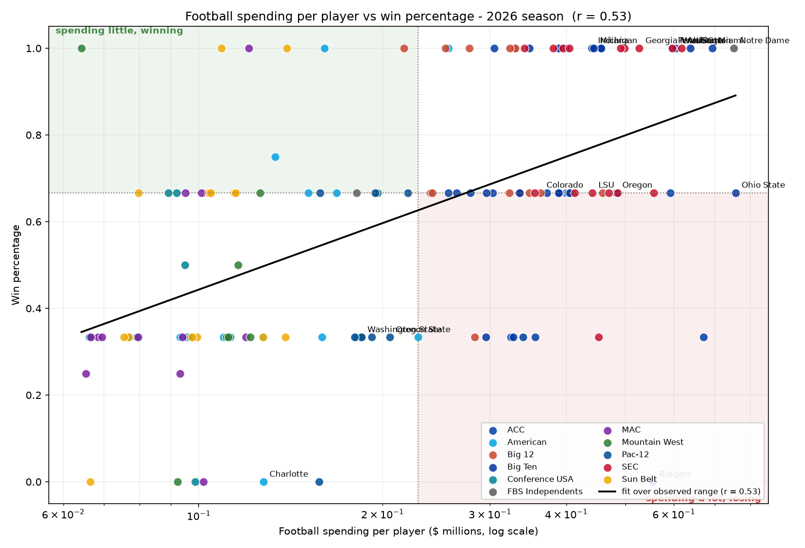

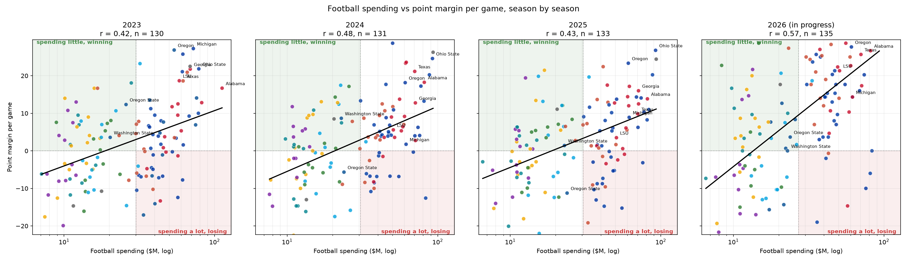

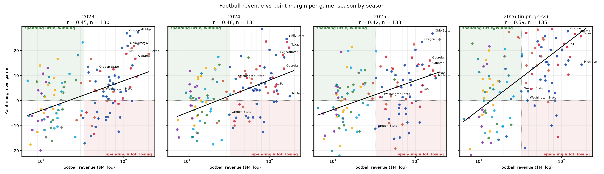

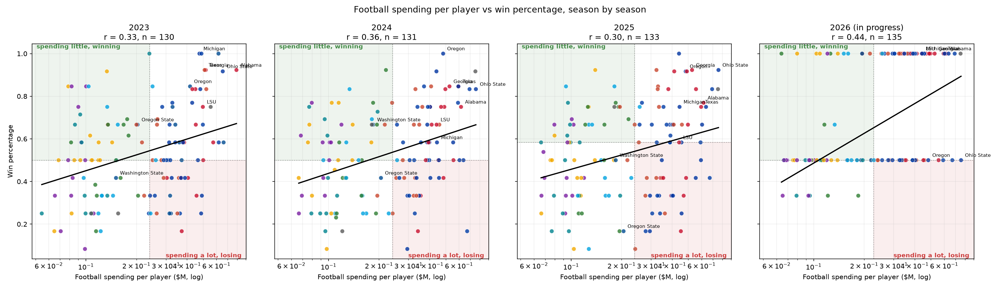

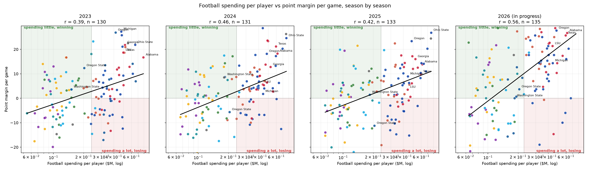

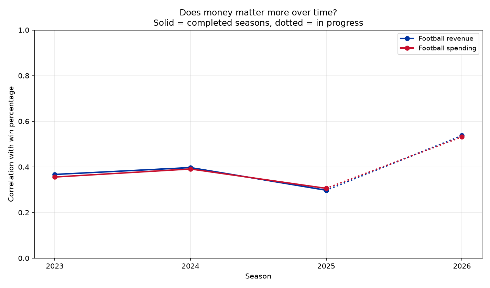

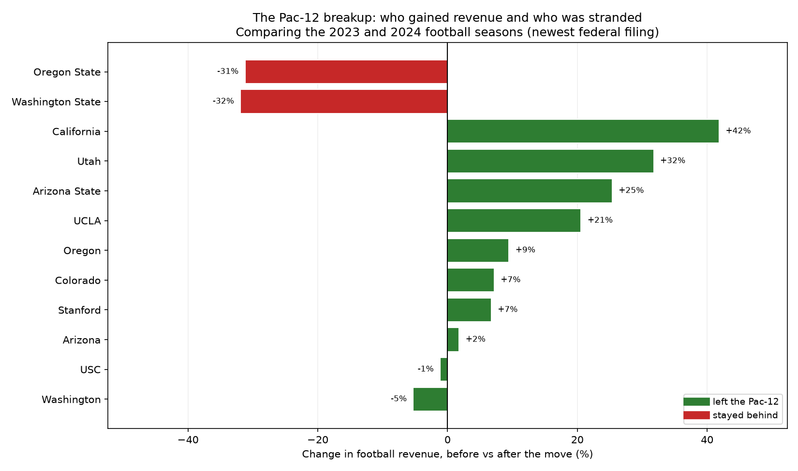

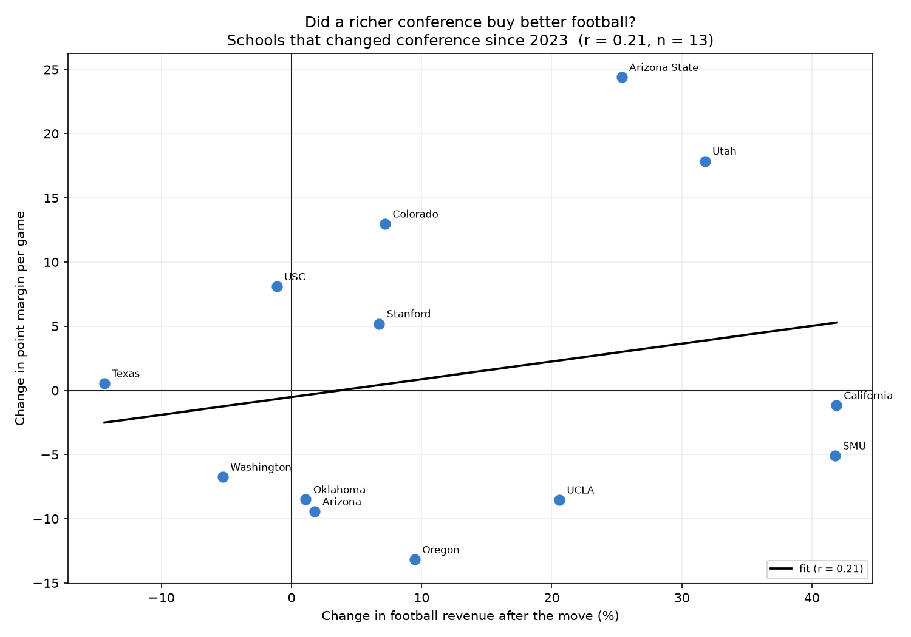

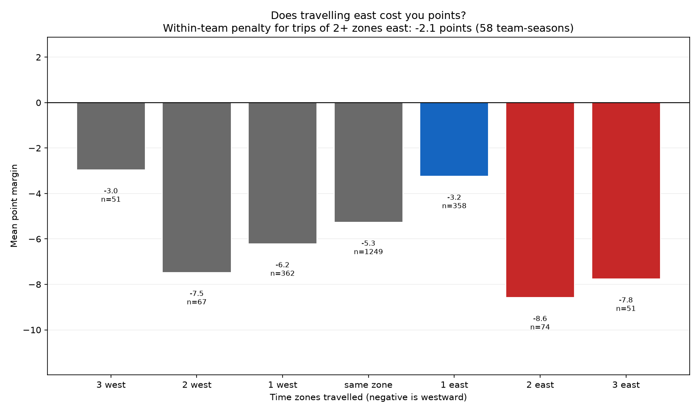

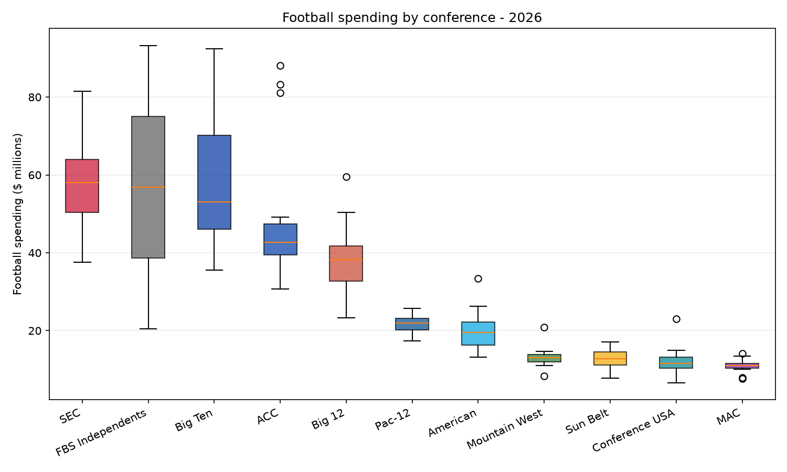

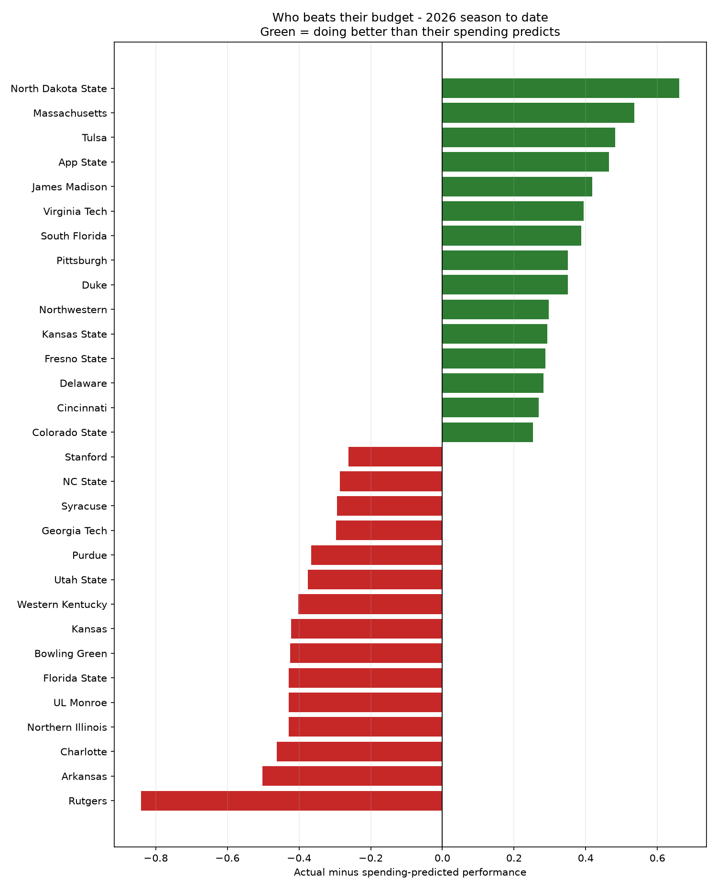

## Caveats worth repeating

- EADA revenue is self-reported and, at many private schools, revenue is booked to exactly equal expenses. Comparisons across the public/private line are shakier than they look.
- Football revenue is partly a *consequence* of winning (ticket sales, donations, playoff payouts), so correlation here is bidirectional, not clean causation.
- Revenue-share and NIL money, which is where the 2026 arms race actually happens, is largely private. The cap is public; the allocation is not.
- Conference realignment means a team's conference label changed recently for several programs; fixed effects use the 2026 alignment.
