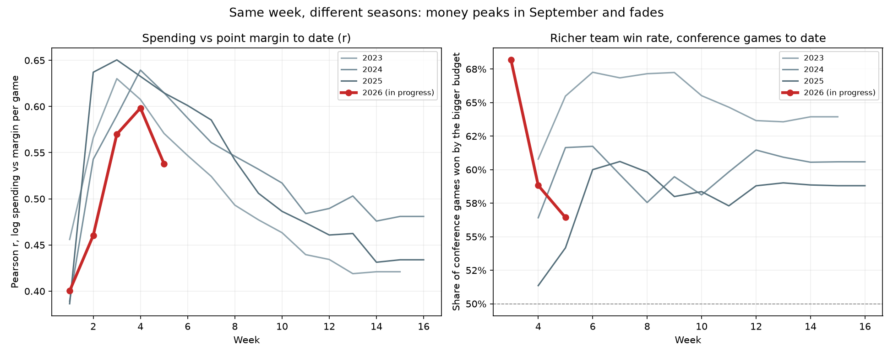
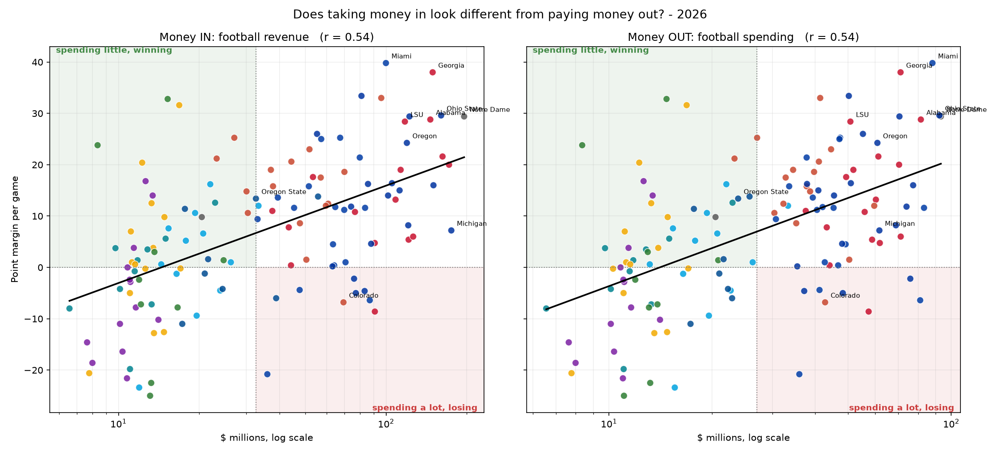
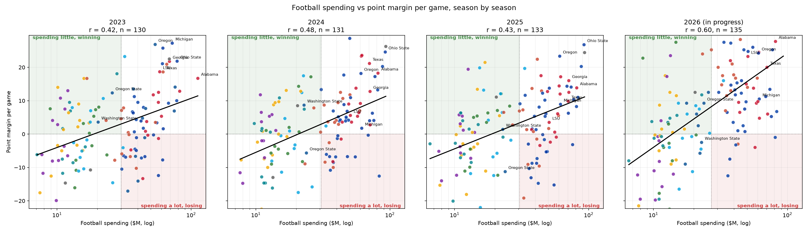
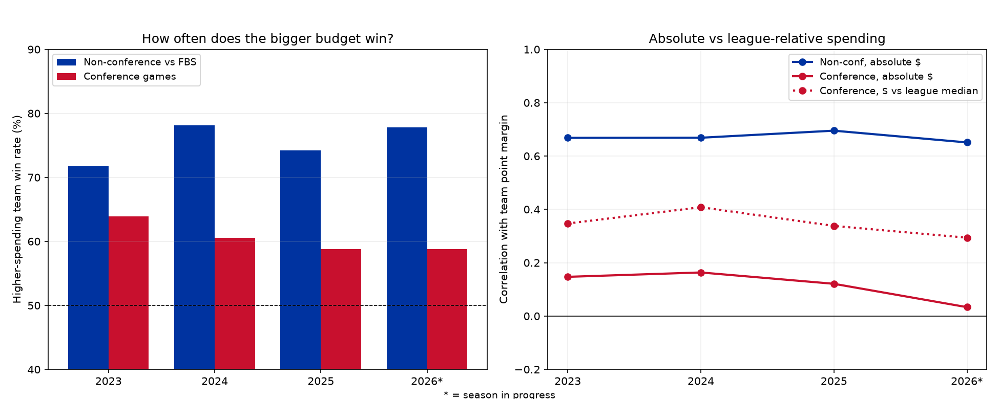
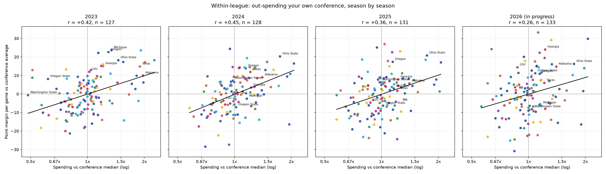
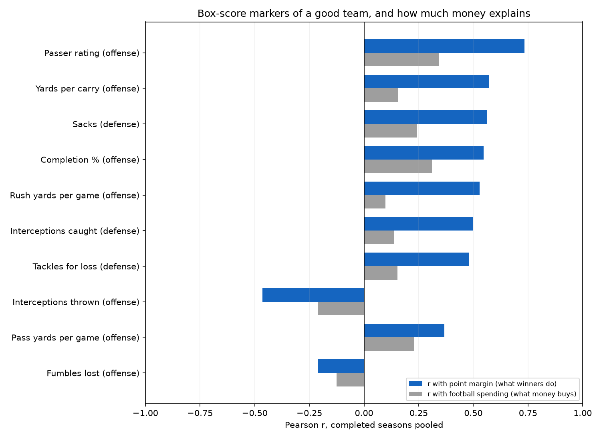
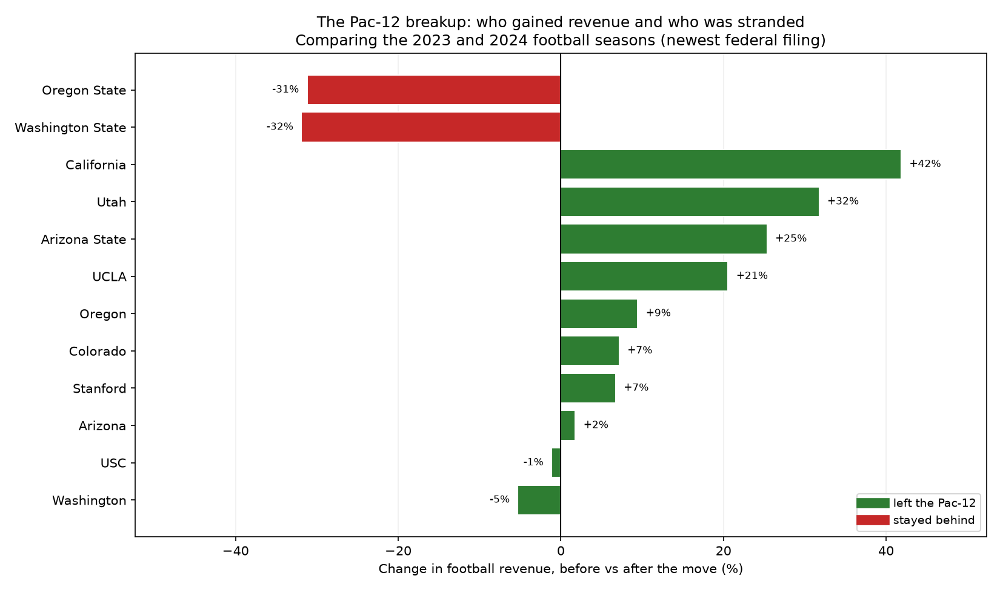
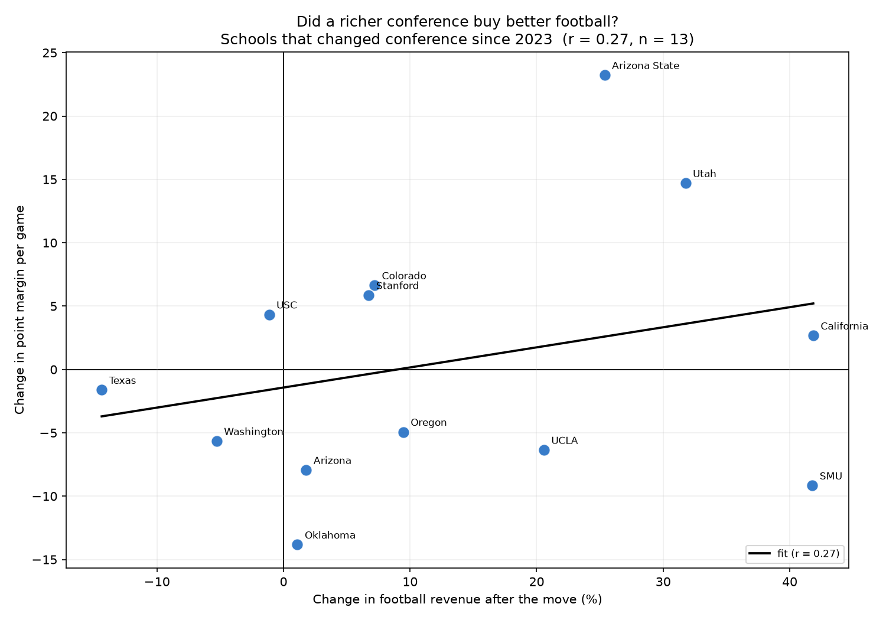
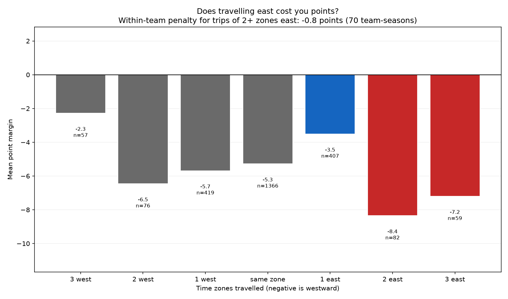
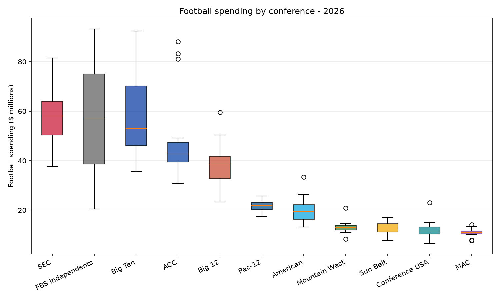

# Money vs winning: the 2026 college football season

_Generated 2026-10-05 16:48. Season 2026, through week 6; teams have played 4-6 games._

> [!WARNING]
> Sample-size warning: this is an in-progress season. Teams have played 4-6 games, which is not enough to separate skill from luck. Treat every coefficient below as directional until November.

## Summary

**What 2026 is showing so far**

- **2026 is a normal season so far, not an unusually rich one.** Through week 5 the money correlation is +0.54, against +0.57 to +0.61 for 2023-25 at the same week. Past seasons faded by 26% as conference play took over; 2026 projects to about +0.40.
- **Biggest surprises against a same-week forecast:** Georgia State (+32), New Mexico (+31), Massachusetts (+29). **Biggest disappointments:** Western Kentucky (-28), UTEP (-27), Arizona State (-25) (points per game).
- **Upsets are rare this year.** Teams with half the opponent's budget have won 4.5% of such games (4 of 89), against 12.9% at the same point of 2023-25, p = 0.03.

**Does money buy wins?**

- **Yes, money tracks results.** Log football spending correlates r = +0.54 with point margin across 135 FBS teams so far in 2026 (r = +0.40 to +0.46 in completed seasons).
- **The edge is biggest across leagues.** The bigger budget wins 74.7% of non-conference FBS games but only 61.1% of conference games.
- **Out-spending your own conference pays as much as raw dollars.** Spend relative to the conference median tracks margin at r = +0.41 over completed seasons, against +0.43 for absolute spend.

**What else makes a good team?**

- **Last season is the best single predictor.** Last year's margin explains 30% of this year's, the budget 20%, both 35%; money still adds signal on top (t = 4.5).
- **Beating your budget is a repeatable trait.** Margin above the budget line carries over at r = +0.43 year to year: something the budget misses (coaching, development, unrecorded NIL money) persists. James Madison, Toledo, Oregon, Notre Dame beat their budget every year; Purdue, Stanford, Kent State, Massachusetts missed it every year.
- **Quarterback play is the clearest on-field marker.** Passer rating tracks margin at r = +0.73 but spending at only +0.34; every box-score marker tracks winning more tightly than spending.
- **No single spending line stands out.** Coaching, recruiting and operations budgets move together (r >= 0.77) and none adds signal once total spending is known. Head coach pay adds nothing beyond the budget (t = +0.8, n = 52).
- **Getting richer has not paid off quickly.** Budget changes between 2023 and 2025 are unrelated to margin changes (r = -0.05, n = 130).

**Realignment and travel**

- **Realignment moved money without anyone playing a down.** Pac-12 leavers: +8.3% median football revenue; Oregon State and Washington State: -31.6%.
- **Long-haul movers may be paying a road tax (suggestive).** Across the 14 schools whose travel grew most, away margin changed -2.4 and home margin +2.0 points per game (road gap -4.4, 9 of 14 negative, p = 0.14).

## Contents

- [1. What 2026 is showing so far](#1-what-2026-is-showing-so-far)
- [2. Does money buy wins?](#2-does-money-buy-wins)
- [3. What separates good teams from bad](#3-what-separates-good-teams-from-bad)
- [4. Realignment and travel](#4-realignment-and-travel)
- [5. Roster economics: NIL and revenue sharing](#5-roster-economics-nil-and-revenue-sharing)
- [6. Reference tables](#6-reference-tables)
- [Data sources](#data-sources)
- [Caveats](#caveats-worth-repeating)

## 1. What 2026 is showing so far

### Is 2026 more money-driven than usual?

Every early-season number looks money-heavy because September is full of mismatches. The fair comparison is the same week of past seasons: here each season is replayed through week 5, next to where it finished.

| Season | r through week 5 | Final r | Conference share of FBS games | Richer team wins, conf games (to date) | Final |
| --- | ---: | ---: | ---: | ---: | ---: |
| 2023 | +0.57 | +0.42 | 37.8% | 65.5% (98 games) | 63.9% |
| 2024 | +0.61 | +0.48 | 30.8% | 61.6% (73 games) | 60.6% |
| 2025 | +0.61 | +0.43 | 30.4% | 54.2% (72 games) | 58.8% |
| 2026 (in progress) | +0.54 | - | 38.4% | 56.4% (101 games) | - |

At week 5, 2026 sits at r = **+0.54**, right in line with 2023-25 at the same point (+0.57 to +0.61). Every past season peaked around weeks 3-4 and then faded as conference play took over. Applying their average fade projects 2026 to finish near **r = +0.40**, not the headline number at the top of this report.

Inside conference play, the bigger budget has won **56.4%** of 101 games so far, against 60.4% for 2023-25 at the same week. With this few conference games, a gap under about ten points is noise.

### Surprises against a preseason forecast

A forecast built only from last season's margin and this season's budget. It is fitted on 2024-2025 margins *through week 5* against FBS opponents only, so early-season schedule quirks are part of the expectation and FCS blowouts do not count. It already tracks reality well (r = +0.65 across 133 teams), so the teams far off it are the real stories of the season.

**Ahead of forecast**

| Program | Conf | Football exp | Last season | FBS games | Forecast | Actual | Gap |
| --- | --- | ---: | ---: | ---: | ---: | ---: | ---: |
| Georgia State | Sun Belt | $12.3M | -18.1 | 4 | -18.5 | +13.2 | **+31.8** |
| New Mexico | Mountain West | $14.7M | +5.4 | 4 | -5.4 | +25.2 | **+30.7** |
| Massachusetts | MAC | $13.4M | -27.5 | 3 | -22.0 | +7.0 | **+29.0** |
| UCLA | Big Ten | $55.2M | -15.2 | 4 | -0.8 | +26.0 | **+26.8** |
| Nevada | Mountain West | $13.0M | -9.9 | 3 | -14.0 | +8.3 | **+22.4** |
| Liberty | Conference USA | $23.0M | -0.9 | 4 | -3.6 | +15.5 | **+19.1** |
| Nebraska | Big Ten | $70.6M | +6.2 | 4 | +12.1 | +30.0 | **+17.9** |
| LSU | SEC | $50.7M | +3.5 | 4 | +7.2 | +23.2 | **+16.1** |

**Behind forecast**

| Program | Conf | Football exp | Last season | FBS games | Forecast | Actual | Gap |
| --- | --- | ---: | ---: | ---: | ---: | ---: | ---: |
| Western Kentucky | Conference USA | $11.0M | +6.3 | 4 | -8.1 | -36.0 | **-27.9** |
| UTEP | Mountain West | $11.1M | -7.1 | 4 | -14.5 | -41.5 | **-27.0** |
| Arizona State | Big 12 | $50.4M | +1.7 | 3 | +6.2 | -19.0 | **-25.2** |
| Rutgers | Big Ten | $75.9M | -3.2 | 4 | +8.4 | -15.5 | **-23.9** |
| Arkansas | SEC | $57.4M | -0.9 | 4 | +6.4 | -15.0 | **-21.4** |
| Clemson | ACC | $81.1M | +8.2 | 5 | +14.5 | -6.4 | **-20.9** |
| Old Dominion | Sun Belt | $14.8M | +13.4 | 4 | -1.6 | -21.0 | **-19.4** |
| Stanford | ACC | $36.0M | -10.3 | 5 | -3.1 | -20.8 | **-17.7** |

### Upsets: when the smaller budget wins

A money mismatch is a game against an FBS opponent with at least twice the football budget. Through week 5 of each season:

| Season | Mismatch games | Upsets | Upset rate |
| --- | ---: | ---: | ---: |
| 2023 | 96 | 13 | 13.5% |
| 2024 | 92 | 10 | 10.9% |
| 2025 | 84 | 12 | 14.3% |
| 2026 (in progress) | 89 | 4 | 4.5% |

2026 has produced **fewer upsets** than usual: 4.5% of mismatches against 12.9% for 2023-25 pooled (Fisher exact p = 0.03). Favourites in lopsided games are holding serve.

**Biggest 2026 upsets by budget gap**

| Week | Winner | Budget | Beat | Budget | Gap | Score |
| ---: | --- | ---: | --- | ---: | ---: | :---: |
| 1 | Massachusetts | $13.4M | Rutgers | $75.9M | 5.7x | 37-21 |
| 5 | UNLV | $20.9M | California | $46.7M | 2.2x | 39-31 |
| 3 | Toledo | $12.6M | Temple | $26.3M | 2.1x | 49-48 |
| 5 | Northwestern | $37.9M | Penn State | $77.4M | 2.0x | 34-13 |

## 2. Does money buy wins?

### Spending versus revenue: which one tracks winning?

Revenue is money **coming in** and partly a *reward* for winning (tickets, donations, playoff payouts). Spending is money **going out** and closer to an *input* the program controls.

In practice they are nearly the same variable: log revenue and log spending correlate at **0.96**, so every money metric below tells essentially the same story. The table shows correlations with each outcome; the full table with p-values and Spearman rank correlations is in `data/processed/correlations_<season>.csv`.

| Money metric | n | Margin/g | Win% | Pts/g | Allowed/g |
| --- | ---: | ---: | ---: | ---: | ---: |
| 247 team talent composite | 19 | +0.57* | +0.69** | +0.59** | -0.20 |
| Athletics dept revenue | 135 | +0.55*** | +0.48*** | +0.47*** | -0.47*** |
| Football revenue | 135 | +0.54*** | +0.47*** | +0.47*** | -0.46*** |
| Men's coaching payroll | 135 | +0.54*** | +0.48*** | +0.48*** | -0.44*** |
| Athletics dept expenses | 135 | +0.54*** | +0.47*** | +0.47*** | -0.46*** |
| Football expenses | 135 | +0.54*** | +0.47*** | +0.48*** | -0.44*** |
| Football non-operating spend | 135 | +0.54*** | +0.48*** | +0.47*** | -0.44*** |
| Football spend per player | 135 | +0.52*** | +0.46*** | +0.47*** | -0.43*** |
| Men's recruiting spend | 135 | +0.52*** | +0.47*** | +0.46*** | -0.42*** |
| Avg men's head coach salary | 135 | +0.51*** | +0.45*** | +0.48*** | -0.39*** |
| Head coach total pay | 52 | +0.20 | +0.17 | +0.06 | -0.27* |

Money columns are log-scaled except the talent composite. `*` p<0.05, `**` p<0.01, `***` p<0.001.

### Where the money edge is won: in or out of conference

The national correlation blends two different contests. **Non-conference** games pit SEC budgets against MAC budgets; **conference** games pit a school against peers with similar media money. Splitting them shows where the money edge is won.

| Season | Non-conf FBS games | Richer team wins | Conf games | Richer team wins | Conf r, absolute $ | Conf r, $ vs league |
| ---: | ---: | ---: | ---: | ---: | ---: | ---: |
| 2023 | 202 | 71.8% | 541 | 63.9% | +0.15 | +0.35 |
| 2024 | 212 | 78.2% | 540 | 60.6% | +0.16 | +0.41 |
| 2025 | 203 | 74.2% | 559 | 58.8% | +0.12 | +0.34 |
| 2026 (in progress) | 164 | 77.8% | 107 | 56.4% | +0.08 | +0.27 |

Across completed seasons the bigger budget wins **74.7%** of non-conference games against FBS opponents but only **61.1%** of conference games. Inside a conference, absolute dollars barely track results (r = +0.14); dollars *relative to the league median* do (r = +0.36).

> [!IMPORTANT]
> Only **39%** of 2026 FBS-vs-FBS games so far are conference games, so the in-progress season is still dominated by the mismatches where money matters most. Expect the 2026 overall correlation to drift down toward the completed-season range as conference play fills the schedule.

Games against FCS opponents are excluded from both columns; FBS teams won those by an average of **+32.0 points**, which is why early-season margin tables look inflated.

### Within the league: out-spending your peers

Spending is re-expressed as a multiple of the conference median, and margin as points above the conference average. That removes the SEC-versus-MAC gap and leaves the question a school can act on: *does out-spending your own league pay?*

| Season | n | National r (absolute $) | Within-league r (relative $) | p (within) |
| --- | ---: | ---: | ---: | ---: |
| 2023 | 127 | +0.40 | +0.42 | 7e-07 |
| 2024 | 128 | +0.46 | +0.45 | 8e-08 |
| 2025 | 131 | +0.42 | +0.36 | 3e-05 |
| 2026 (in progress) | 133 | +0.53 | +0.26 | 0.002 |

Over a **full** season, out-spending your own conference predicts margin about as well as raw dollars do nationally (within r +0.41 vs national +0.43, averaged over completed seasons). The in-progress season looks different mainly because September is packed with cross-league mismatches that inflate the national number; see the schedule split above.

**Biggest spenders relative to their Power 4 league**

| Program | Conf | Football exp | x league median | Record | Margin/g |
| --- | --- | ---: | ---: | :---: | ---: |
| Miami | ACC | $88.1M | 2.06x | 5-0 | +39.8 |
| Florida State | ACC | $83.3M | 1.95x | 3-2 | +11.6 |
| Clemson | ACC | $81.1M | 1.90x | 3-2 | -6.4 |
| Ohio State | Big Ten | $92.4M | 1.74x | 4-1 | +29.6 |
| TCU | Big 12 | $59.6M | 1.56x | 2-3 | +12.0 |
| Penn State | Big Ten | $77.4M | 1.46x | 3-2 | +16.0 |

**Smallest spenders relative to their Power 4 league**

| Program | Conf | Football exp | x league median | Record | Margin/g |
| --- | --- | ---: | ---: | :---: | ---: |
| Houston | Big 12 | $23.3M | 0.61x | 4-1 | +21.2 |
| Mississippi State | SEC | $37.6M | 0.65x | 4-1 | +11.0 |
| Maryland | Big Ten | $35.5M | 0.67x | 2-3 | +0.2 |
| Purdue | Big Ten | $37.2M | 0.70x | 2-3 | -4.6 |
| Kansas State | Big 12 | $27.1M | 0.71x | 3-1 | +25.2 |
| Northwestern | Big Ten | $37.9M | 0.71x | 3-1 | +16.2 |

### Holding the conference fixed

Conference dummies absorb the media-rights advantage, so the money coefficient answers a narrower question: *within the same league, does the bigger budget win more?*

Outcome **win_pct**, n = 135, R² = 0.256 (adjusted 0.190), with 10 conference dummies.

| Term | Estimate | Std error | t | p |
| --- | ---: | ---: | ---: | ---: |
| log10(football_expenses) | +0.5831 | 0.1797 | +3.25 | 0.0015** |

Read: doubling the football budget within the same conference is associated with **+17.6 points of win percentage** (log10(2) = 0.301).

## 3. What separates good teams from bad

### Last season versus this budget

Before crediting the budget, compare it with the simplest forecast there is: last season's point margin.

| Season | n | r, last season's margin | r, football spending |
| --- | ---: | ---: | ---: |
| 2024 | 130 | +0.53 | +0.47 |
| 2025 | 131 | +0.56 | +0.43 |
| 2026 (in progress) | 133 | +0.47 | +0.56 |

Pooling 2024-2025, last season alone explains **30%** of the spread in point margin, spending alone **20%** and both together **35%**. Both stay significant in the joint model (t = 7.6 for last season, 4.5 for spending): each point of last season's margin carries 0.44 points forward, and doubling the budget adds **+2.8 points per game** on top. Money is not just a proxy for being good last year.

In 2026 so far spending out-predicts last season, the reverse of every completed year. That is the September schedule again: non-conference mismatches reward budget, and conference play has barely started.

### Who beats their budget year after year

Each team gets a residual: its point margin minus what a team with its budget would be expected to post (a separate line each season). If beating the budget were luck, the residual would not repeat.

| Season | n | r with previous season's residual |
| --- | ---: | ---: |
| 2024 | 130 | +0.41 |
| 2025 | 131 | +0.45 |
| 2026 (in progress) | 133 | +0.31 |

Across completed seasons the residual repeats at r = **+0.43**: a team that beat its budget by 10 points typically beats it by about 4 the next year. That persistent part is whatever the budget line misses: coaching, scheme, player development, roster continuity, and money the federal filings do not see, such as NIL collectives.

**Consistently beating their budget (points per game)**

| Program | Conf | Football exp | 2023 | 2024 | 2025 | Average |
| --- | --- | ---: | ---: | ---: | ---: | ---: |
| James Madison | Sun Belt | $16.9M | +17.7 | +14.6 | +22.2 | **+18.2** |
| Toledo | MAC | $12.6M | +15.8 | +9.1 | +22.2 | **+15.7** |
| Oregon | Big Ten | $60.8M | +20.1 | +10.0 | +15.2 | **+15.1** |
| Notre Dame | FBS Independents | $93.3M | +14.2 | +14.9 | +13.3 | **+14.1** |
| Ohio State | Big Ten | $92.4M | +12.7 | +13.3 | +15.7 | **+13.9** |
| SMU | ACC | $45.3M | +19.8 | +11.8 | +6.1 | **+12.6** |
| Ohio | MAC | $10.8M | +10.7 | +16.7 | +9.6 | **+12.3** |
| Memphis | American | $22.0M | +9.6 | +12.0 | +11.0 | **+10.9** |

**Consistently missing their budget (points per game)**

| Program | Conf | Football exp | 2023 | 2024 | 2025 | Average |
| --- | --- | ---: | ---: | ---: | ---: | ---: |
| Purdue | Big Ten | $37.2M | -9.8 | -28.6 | -17.8 | **-18.7** |
| Stanford | ACC | $36.0M | -20.8 | -15.0 | -14.8 | **-16.9** |
| Kent State | MAC | $10.4M | -15.8 | -25.0 | -8.2 | **-16.3** |
| Massachusetts | MAC | $13.4M | -11.6 | -9.7 | -25.1 | **-15.5** |
| Michigan State | Big Ten | $48.2M | -19.5 | -13.1 | -11.9 | **-14.8** |
| Charlotte | American | $15.6M | -9.4 | -9.3 | -20.7 | **-13.1** |
| Temple | American | $26.3M | -16.7 | -17.6 | -4.2 | **-12.8** |
| Oklahoma State | Big 12 | $32.8M | -3.3 | -11.9 | -23.0 | **-12.8** |

The over-performers span budgets from Ohio and Toledo ($12.6M or less) to Notre Dame and Ohio State ($92.4M or more), so this is not just rich teams outrunning a straight line.

### On-field markers of a good team

Which on-field numbers separate winners from losers, and which of them does money buy? Each season stat is correlated with point margin and with football spending, pooling completed seasons (n = 393 team-seasons).

| Stat | r with point margin | r with spending |
| --- | ---: | ---: |
| Passer rating (offense) | +0.73 | +0.34 |
| Yards per carry (offense) | +0.57 | +0.16 |
| Sacks (defense) | +0.56 | +0.24 |
| Completion % (offense) | +0.55 | +0.31 |
| Rush yards per game (offense) | +0.53 | +0.10 |
| Interceptions caught (defense) | +0.50 | +0.14 |
| Tackles for loss (defense) | +0.48 | +0.15 |
| Interceptions thrown (offense) | -0.46 | -0.21 |
| Pass yards per game (offense) | +0.37 | +0.23 |
| Fumbles lost (offense) | -0.21 | -0.13 |

**Passer rating** is the clearest marker of a good team (r = +0.73), yet spending explains it only loosely (r = +0.34). The widest gap is rush yards per game: r = +0.53 with margin but +0.10 with spending. Every marker tracks winning more tightly than it tracks spending: money buys a better roster at the margin, but what the roster does on the field is mostly something else.

These are symptoms of a good team rather than independent causes: teams that lead run the ball late, and good defenses force interceptions.

> [!NOTE]
> Richer teams also play **tougher schedules**: spending correlates r = +0.41 with opponents' win percentage. Raw point margin therefore slightly *understates* what money buys.

### Which spending line matters?

Is it the coaches, the recruiting budget or game-day operations? Each spending line is added to a model that already contains the total football budget. A line that mattered on its own would keep a significant coefficient (|t| > 2).

| Spending line | n | Corr. with total budget | r with margin alone | Added coef (pts per SD) | t | R² gain |
| --- | ---: | ---: | ---: | ---: | ---: | ---: |
| Men's coaching payroll | 135 | 0.94 | +0.54 | +4.5 | +1.5 | +0.012 |
| Avg men's head coach salary | 135 | 0.84 | +0.51 | +2.7 | +1.4 | +0.011 |
| Avg men's assistant coach salary | 135 | 0.90 | +0.54 | +3.9 | +1.7 | +0.015 |
| Men's recruiting spend | 135 | 0.92 | +0.52 | +2.0 | +0.8 | +0.004 |
| Football game-day operations | 135 | 0.84 | +0.47 | +0.8 | +0.4 | +0.001 |
| Head coach total pay | 52 | 0.77 | +0.20 | +1.9 | +0.8 | +0.012 |

Every line correlates **0.77 or higher** with the total budget, and none survives with the budget held fixed (largest |t| = 1.7, Avg men's assistant coach salary). Schools that spend big spend big on everything, so this data cannot say *which* line buys wins - only that the overall scale of the operation does.

#### What the head coach is paid

Verified total pay is on file for **52 of 138 teams**. Public universities subject to open-records laws provide high-confidence, cited figures. Private institutions (e.g., USC, Notre Dame, Stanford, Miami, TCU, Baylor, SMU, Vanderbilt) are exempt from FOIA disclosure and remain marked as unverified with blank salaries rather than synthetic estimates.

Across those 52 teams, head coach pay correlates **r = +0.20** with point margin per game (p = 0.163), weaker than total spending. Part of that is the sample: 92% of the verified rows are Power 4 schools, which squeezes the spread in both pay and results. With the total budget in the model, coach pay adds nothing (see the spending-line table above).

| Coach | School | Total pay | Buyout | Win% | Point margin |
| --- | --- | ---: | ---: | ---: | ---: |
| Kirby Smart | Georgia | $13.3M | $105.1M | 1.000 | +38.0 |
| Ryan Day | Ohio State | $12.6M | $70.9M | 0.800 | +29.6 |
| Dabo Swinney | Clemson | $11.4M | $60.0M | 0.600 | -6.4 |
| Steve Sarkisian | Texas | $10.8M | $60.3M | 1.000 | +20.0 |
| Dan Lanning | Oregon | $10.4M | $56.7M | 0.750 | +24.2 |
| Kalen DeBoer | Alabama | $10.2M | $60.8M | 1.000 | +28.8 |
| Brian Kelly | LSU | $10.2M | $53.3M | 0.800 | +28.4 |
| Bill Belichick | North Carolina | $10.1M | $20.8M | 0.500 | +4.5 |
| Josh Heupel | Tennessee | $9.0M | $37.5M | 0.800 | +21.6 |
| Eliah Drinkwitz | Missouri | $9.0M | $42.6M | 0.800 | +17.6 |

### Does getting richer help?

The cross-section says rich programs win. Does *getting* richer help? Comparing each school's 2023 and 2025 seasons (median budget change +7%), the budget change is unrelated to the margin change: r = **-0.05** (p = 0.59, n = 130).

Money appears to work through program scale built over many years - facilities, staff depth, recruiting pipelines - rather than a one-year raise. Two years of filings is a short window, so treat this as "no quick payoff yet" rather than "no payoff".

## 4. Realignment and travel

### What happened to the schools that switched conference

Between 2023 and 2026 the sport redrew its map: **24 schools changed conference**. That is the closest thing this data has to a controlled experiment, because the money moved for reasons that had nothing to do with how well any given team was playing.

> [!IMPORTANT]
> The federal finance filings lag the field by two years, so the newest money year available is the 2024 season. Schools that moved in 2024 therefore have exactly **one** post-move budget year on record, and schools that moved in 2026 have **none**. Their money columns are intentionally blank rather than filled with stale pre-move values.

#### The Pac-12 breakup

Ten of the twelve 2023 Pac-12 members left. Two did not, and the gap between those two groups is the single starkest result in this project.

| School | Role | Football revenue before | After | Change | Point margin change |
| --- | --- | ---: | ---: | ---: | ---: |
| Arizona | left | $37.1M | $37.8M | +1.8% | -7.0 |
| Arizona State | left | $40.2M | $50.4M | +25.4% | +19.1 |
| California | left | $45.1M | $64.0M | +41.9% | +2.0 |
| Colorado | left | $64.7M | $69.3M | +7.2% | +5.4 |
| Oregon | left | $109.2M | $119.6M | +9.5% | -4.9 |
| Stanford | left | $33.7M | $36.0M | +6.7% | +3.1 |
| UCLA | left | $45.8M | $55.2M | +20.6% | -6.4 |
| USC | left | $74.9M | $74.0M | -1.1% | +3.8 |
| Utah | left | $72.8M | $95.9M | +31.8% | +14.7 |
| Washington | left | $127.8M | $121.0M | -5.3% | -6.7 |
| Oregon State | stayed behind | $47.4M | $32.6M | -31.2% | -13.5 |
| Washington State | stayed behind | $57.0M | $38.8M | -31.9% | -2.2 |
| Boise State | joined new Pac-12 | $41.1M | - | n/a | +2.6 |
| Colorado State | joined new Pac-12 | $19.6M | - | n/a | +3.9 |
| Fresno State | joined new Pac-12 | $18.3M | - | n/a | +6.8 |
| San Diego State | joined new Pac-12 | $27.5M | - | n/a | -3.4 |
| Texas State | joined new Pac-12 | $18.0M | - | n/a | -5.2 |
| Utah State | joined new Pac-12 | $17.4M | - | n/a | -10.3 |

Median revenue change for the schools that left: **+8.3%**. For the two left behind: **-31.6%**. Washington State and Oregon State did nothing differently on the field; they simply lost their conference, and roughly a third of their football revenue went with it.

> [!NOTE]
> The leavers gained less than the headline media deals imply because several joined on **reduced shares**. Oregon and Washington entered the Big Ten at a reported ~$30M annual share against a full share of $65M+, escalating roughly $1M a year until they phase in near the end of the decade. That is why their measured revenue change here is single digit or even negative while UCLA and California, which did not take the same discount, moved much more.

##### Realignment financial mechanics

The dissolution of the original Pac-12 resulted in massive financial shifts, driven by media rights disparities and legal settlements:

- **WSU/OSU Settlement & Exit Fees**: The 10 departing members forfeited **$65 million total** ($6.5M per school) to Washington State and Oregon State, who retained conference assets and liabilities.
- **Media-Rights Hierarchy**: Big Ten agreements pay ~$1.1B-$1.2B annually (~$65M-$75M/school full share), compared to ~$380M for the Big 12 (~$31M/school) and ~$240M-$400M for the ACC.
- **Tiered Big Ten Entry**: USC and UCLA entered at full shares (~$65M+), while Oregon and Washington entered at a $30M partial share increasing $1M/year until reaching parity in 2030.
- **Travel Cost Inflation**: In their official presentation to the UC Board of Regents, UCLA Athletics projected an increase of **$4.6 million to $5.8 million** in annual travel and logistics costs due to cross-country Big Ten travel.

| Financial impact | Reported figure | Scope | Confidence | Source |
| :--- | :--- | :--- | :--- | :--- |
| WSU/OSU Settlement | $65M Withheld | 10 Departing Schools | High | [The Athletic](https://theathletic.com/5155122/2023/12/21/pac-12-settlement-washington-state-oregon-state/) |
| B1G Media Deal | ~$1.1 - $1.2B/yr | Big Ten | High | [CBS Sports](https://www.cbssports.com/college-football/news/big-ten-reaches-seven-year-media-rights-deal-with-cbs-fox-and-nbc-worth-more-than-7-billion/) |
| Big 12 Media Deal | ~$380M/yr | Big 12 | High | [ESPN](https://www.espn.com/college-football/story/_/id/34907937/big-12-agrees-new-media-rights-deal-espn-fox-sports) |
| USC / UCLA B1G Share | Full Share (~$65M+) | USC, UCLA | High | [LA Times](https://www.latimes.com/sports/ucla/story/2022-06-30/ucla-usc-big-ten-conference-move) |
| Oregon / UW B1G Share | $30M, +$1M/yr | Oregon, Washington | High | [ESPN](https://www.espn.com/college-football/story/_/id/38135860/oregon-washington-join-big-ten-2024) |
| Increased Travel Costs | $4.6M to $5.8M | UCLA | High | [LA Times](https://www.latimes.com/sports/ucla/story/2022-12-14/ucla-big-ten-move-uc-regents-approval-travel-costs) |

#### The other schools that moved

| School | Move | Effective | Revenue change | Point margin change |
| --- | --- | ---: | ---: | ---: |
| Army | FBS Independents to American | 2024 | not yet filed | +10.2 |
| Oklahoma | Big 12 to SEC | 2024 | +1.1% | -13.8 |
| SMU | American to ACC | 2024 | +41.8% | -9.4 |
| Texas | Big 12 to SEC | 2024 | -14.4% | -1.6 |
| Massachusetts | FBS Independents to MAC | 2025 | not yet filed | +7.1 |
| Louisiana Tech | Conference USA to Sun Belt | 2026 | not yet filed | +6.8 |
| Northern Illinois | MAC to Mountain West | 2026 | not yet filed | -23.4 |
| UTEP | Conference USA to Mountain West | 2026 | not yet filed | -15.5 |

### Travel, time zones and the cost of flying east

Realignment moved miles as well as money. A team flying east loses hours: a noon kickoff on the east coast is a 9am body clock for a team from California. The table below pools every completed game from 2023 to 2026 by how many time zones the team crossed.

| Travel | Games | Mean margin | Win rate |
| --- | ---: | ---: | ---: |
| 3 zones west | 57 | -2.3 | 42% |
| 2 zones west | 76 | -6.5 | 43% |
| 1 zone west | 419 | -5.7 | 37% |
| same zone | 1366 | -5.3 | 41% |
| 1 zone east | 407 | -3.5 | 42% |
| 2 zones east | 82 | -8.4 | 37% |
| 3 zones east | 59 | -7.2 | 37% |

> [!IMPORTANT]
> The raw split above is confounded. The teams that fly two or more zones east are disproportionately Group of Five programs taking a paycheque game at a blue blood, so they would have lost anyway. Comparing each team against **itself** - its own margin on long eastward trips versus its own margin on every other away game - the penalty is **-0.8 points** across 70 team-seasons (-5.1 on long eastward trips versus -4.3 on other away games).

#### Who now travels further

Average time zones crossed per away game, before and after the move. The old Pac-12 fit inside two zones; the Big Ten and ACC do not. Home margin is the control: a tougher new league lowers both, while a travel burden should only show up on the road.

| School | Move | Zones before | Zones after | Away margin change | Home margin change | Road gap change |
| --- | --- | ---: | ---: | ---: | ---: | ---: |
| Stanford | Pac-12 to ACC | -0.20 | +2.00 | -7.3 | +15.4 | -22.7 |
| Arizona State | Pac-12 to Big 12 | -0.75 | +0.83 | +15.5 | +23.6 | -8.1 |
| Colorado State | Mountain West to Pac-12 | -0.44 | +1.00 | -3.2 | +2.5 | -5.8 |
| California | Pac-12 to ACC | +0.50 | +1.92 | -2.3 | +5.3 | -7.6 |
| Colorado | Pac-12 to Big 12 | -0.33 | +1.00 | +9.1 | +3.9 | +5.1 |
| UCLA | Pac-12 to Big Ten | +0.33 | +1.57 | -10.7 | -16.1 | +5.4 |
| San Diego State | Mountain West to Pac-12 | +0.41 | +1.50 | -12.3 | +0.6 | -12.9 |
| Utah | Pac-12 to Big 12 | -0.40 | +0.62 | +17.8 | +6.6 | +11.2 |
| Washington | Pac-12 to Big Ten | +0.80 | +1.73 | -16.9 | -0.8 | -16.1 |
| Arizona | Pac-12 to Big 12 | -0.33 | +0.58 | -17.3 | -4.1 | -13.2 |
| USC | Pac-12 to Big Ten | +1.00 | +1.91 | +2.1 | +3.7 | -1.6 |
| Oregon | Pac-12 to Big Ten | +0.80 | +1.67 | -3.9 | -11.3 | +7.3 |
| Boise State | Mountain West to Pac-12 | -0.26 | +0.50 | +6.4 | -2.4 | +8.8 |
| Texas | Big 12 to SEC | +0.00 | +0.60 | -10.9 | +1.2 | -12.1 |

Pooled over these 14 schools, away margin moved **-2.4** and home margin **+2.0** points per game. The road gap averaged -4.4 with 9 of 14 schools negative, but a one-sample t-test gives p = 0.14: few games per school and different opponents each year make this suggestive, not conclusive.

## 5. Roster economics: NIL and revenue sharing

Following the landmark *House v. NCAA* settlement, college football entered an era structured by an institutional revenue-sharing cap: ~$20.5M for the 2025-26 academic year, escalating ~4% to ~$21.32M for 2026-27.

> [!IMPORTANT]
> Revenue-sharing caps and 247Sports team talent scores are public, > but **per-school football allocations and NIL collective payrolls > remain undisclosed.** While athletic departments widely cite a > rule of thumb directing ~75% of the cap to football (~$16M), no > major program publishes its exact balance sheet split. Rather than > interpolating or fabricating synthetic estimates, per-school > allocation and roster payroll columns (`football_allocation_est`, > `roster_payroll_est`) are left blank (`n/a`) until audited disclosures > exist.

| Data point | Reported figure | Scope | Confidence | Source |
| :--- | :--- | :--- | :--- | :--- |
| Revenue-share cap | ~$20.5M (25-26), ~$21.32M (26-27) | Every school | High | [ESPN](https://www.espn.com/college-sports/story/_/id/40206364/ncaa-power-conferences-agree-settle-house-vs-ncaa-lawsuit) |
| Football share of cap | ~75% | League-wide rule of thumb | Low per school | [Yahoo Sports](https://sports.yahoo.com/college-sports-revenue-sharing-model/) |
| Collective budgets | $15M-$20M+ | Elite tier only | Medium | [On3](https://www.on3.com/nil/news/college-football-nil-collective-budgets/) |
| Roster valuations | $12M-$15M+ | Top 5 rosters | Medium | [On3](https://www.on3.com/nil/rankings/player/college/football/) |
| 2026 recruiting spend | $3M-$5M | Top 15 classes | Medium | [247Sports](https://247sports.com/college-football/recruiting/) |
| Per-school football allocation | not disclosed | — | — | — |

### Talent composite and the equal-cap paradox

Because the House settlement revenue-share cap is uniform across all participating institutions, direct school-to-athlete distributions provide virtually zero competitive variance among top programs: every Power 4 powerhouse will max out the same cap. Consequently, competitive talent differentiation shifts into two distinct arenas: third-party booster collective fundraising ($15M-$20M+ at perennial blue-bloods) and discretionary athletic department spending on coaching, analysts, and support infrastructure.

247Sports Team Talent Composite ratings are on file for **19 elite programs** only. Among them, talent tracks scoring (r = +0.591 with points per game, p = 0.008). With so few schools, all from the top of the sport, treat this as a hint rather than a result.

## 6. Reference tables

### The richest programs and what they have done

| # | Program | Conf | Football rev | Football exp | Dept rev | Record | Win% | Margin/g |
| ---: | --- | --- | ---: | ---: | ---: | :---: | ---: | ---: |
| 1 | Notre Dame | FBS Independents | $195.7M | $93.3M | $289.6M | 5-0 | 100.0% | +29.4 |
| 2 | Michigan | Big Ten | $175.3M | $61.7M | $236.4M | 3-2 | 60.0% | +7.2 |
| 3 | Texas | SEC | $171.9M | $70.4M | $343.1M | 4-0 | 100.0% | +20.0 |
| 4 | Tennessee | SEC | $162.5M | $61.2M | $285.4M | 4-1 | 80.0% | +21.6 |
| 5 | Ohio State | Big Ten | $160.5M | $92.4M | $295.3M | 4-1 | 80.0% | +29.6 |
| 6 | Penn State | Big Ten | $150.3M | $77.4M | $254.4M | 3-2 | 60.0% | +16.0 |
| 7 | Georgia | SEC | $149.3M | $71.1M | $233.5M | 5-0 | 100.0% | +38.0 |
| 8 | Alabama | SEC | $146.3M | $81.5M | $244.6M | 5-0 | 100.0% | +28.8 |
| 9 | Oklahoma | SEC | $126.2M | $71.2M | $234.4M | 2-2 | 50.0% | +6.0 |
| 10 | Nebraska | Big Ten | $122.3M | $70.6M | $205.8M | 5-0 | 100.0% | +29.4 |
| 11 | Auburn | SEC | $121.4M | $58.7M | $205.3M | 3-2 | 60.0% | +5.4 |
| 12 | Washington | Big Ten | $121.0M | $68.9M | $178.4M | 3-2 | 60.0% | +8.2 |
| 13 | Oregon | Big Ten | $119.6M | $60.8M | $167.1M | 3-1 | 75.0% | +24.2 |
| 14 | LSU | SEC | $117.6M | $50.7M | $223.5M | 4-1 | 80.0% | +28.4 |
| 15 | Florida | SEC | $113.4M | $51.8M | $199.2M | 4-1 | 80.0% | +19.0 |
| 16 | Wisconsin | Big Ten | $112.3M | $40.9M | $190.5M | 4-1 | 80.0% | +15.0 |
| 17 | Texas A&M | SEC | $108.5M | $60.2M | $235.5M | 3-2 | 60.0% | +13.2 |
| 18 | Iowa | Big Ten | $105.2M | $50.9M | $180.0M | 4-1 | 80.0% | +16.4 |
| 19 | Minnesota | Big Ten | $101.7M | $45.5M | $156.8M | 4-1 | 80.0% | +14.0 |
| 20 | Miami | ACC | $99.9M | $88.1M | $230.5M | 5-0 | 100.0% | +39.8 |

### Conference summary

| Conference | Teams | Median football rev | Median dept rev | Mean win% | Mean margin |
| --- | ---: | ---: | ---: | ---: | ---: |
| SEC | 16 | $110.9M | $204.9M | 72.8% | +14.0 |
| FBS Independents | 2 | $108.1M | $193.3M | 70.0% | +19.6 |
| Big Ten | 18 | $94.8M | $176.5M | 67.4% | +13.4 |
| ACC | 17 | $64.0M | $151.6M | 62.6% | +10.0 |
| Big 12 | 16 | $49.0M | $130.7M | 70.6% | +15.4 |
| Pac-12 | 8 | $23.1M | $72.8M | 47.5% | +2.2 |
| American | 14 | $19.5M | $62.8M | 52.5% | +2.7 |
| Mountain West | 10 | $13.2M | $50.4M | 48.0% | +0.5 |
| Sun Belt | 14 | $12.9M | $39.9M | 50.0% | +2.5 |
| Conference USA | 10 | $11.6M | $38.5M | 40.5% | -1.3 |
| MAC | 13 | $11.0M | $38.9M | 45.4% | -5.4 |

## Data sources

| Side | Source | Vintage |
| --- | --- | --- |
| Results, scores, stats | ESPN public API | live, 2026 |
| Football revenue/expenses, department revenue, average coach salaries | US Dept of Education EADA filings | report year 2025 |
| Head coach total pay | hand-compiled, per-row citations | 2026 |
| Revenue-share cap, roster payroll, team talent | House settlement reporting, 247Sports | 2026 |

> [!NOTE]
> Federal athletics finances are published on a lag, so the 2025 filings (academic year 2024-25) are the newest available. That is a feature here rather than a bug: past spending is a *leading* indicator of present results, so the direction of causation runs the right way.

## Caveats worth repeating

- EADA revenue is self-reported and, at many private schools, revenue is booked to exactly equal expenses. Comparisons across the public/private line are shakier than they look.
- Football revenue is partly a *consequence* of winning (ticket sales, donations, playoff payouts), so correlation here is bidirectional, not clean causation.
- Revenue-share and NIL money, which is where the 2026 arms race actually happens, is largely private. The cap is public; the allocation is not.
- Conference realignment means a team's conference label changed recently for several programs; fixed effects use the 2026 alignment.
- Conference games are identified from both teams' conference that season; ESPN's schedule feed does not flag them.
