# Money vs winning: the 2026 college football season

_Generated 2026-10-19 16:43. Season 2026, through week 7; teams have played 6-8 games._

> [!WARNING]
> Sample-size warning: this is an in-progress season. Teams have played 6-8 games, which is not enough to separate skill from luck. Treat every coefficient below as directional until November.

## Summary

**What 2026 is showing so far**

- **2026 is a normal season so far, not an unusually rich one.** Through week 7 the money correlation is +0.52, against +0.52 to +0.59 for 2023-25 at the same week. Past seasons faded by 20% as conference play took over; 2026 projects to about +0.41.
- **Biggest surprises against a same-week forecast:** New Mexico (+26), Oregon State (+24), Liberty (+22). **Biggest disappointments:** Stanford (-23), UTEP (-21), Vanderbilt (-21) (points per game).
- **Upsets are rare this year.** Teams with half the opponent's budget have won 6.1% of such games (6 of 99), against 14.2% at the same point of 2023-25, p = 0.03.

**Does money buy wins?**

- **Yes, money tracks results.** Log football spending correlates r = +0.52 with point margin across 135 FBS teams so far in 2026 (r = +0.40 to +0.46 in completed seasons).
- **The edge is biggest across leagues.** The bigger budget wins 74.7% of non-conference FBS games but only 61.1% of conference games.
- **Out-spending your own conference pays as much as raw dollars.** Spend relative to the conference median tracks margin at r = +0.41 over completed seasons, against +0.43 for absolute spend.
- **The return on money is concentrated at the top.** The richest fifth of FBS wins 66.7% of its games against 56.5% for the next fifth and 43.9% for the poorest; the top tier is +7.0 points per game clear of everyone below it.

**What else makes a good team?**

- **Last season is the best single predictor.** Last year's margin explains 30% of this year's, the budget 20%, both 35%; money still adds signal on top (t = 4.5).
- **Beating your budget is a repeatable trait.** Margin above the budget line carries over at r = +0.43 year to year: something the budget misses (coaching, development, unrecorded NIL money) persists. James Madison, Toledo, Oregon, Notre Dame beat their budget every year; Purdue, Stanford, Kent State, Massachusetts missed it every year.
- **Quarterback play is the clearest on-field marker.** Passer rating tracks margin at r = +0.73 but spending at only +0.34; every box-score marker tracks winning more tightly than spending.
- **No single spending line stands out.** Coaching, recruiting and operations budgets move together (r >= 0.77) and none adds signal once total spending is known. Head coach pay adds nothing beyond the budget (t = +0.6, n = 52).
- **Getting richer has not paid off quickly.** Budget changes between 2023 and 2025 are unrelated to margin changes (r = -0.05, n = 130).

**Luck, close games and crowds**

- **Money decides blowouts, not close games.** The bigger budget wins 80.5% of games decided by 17+ points but only 57.8% of one-score games in completed seasons.
- **Records outrunning the scoring in 2026:** Stanford (+1.9 wins), UTSA (+1.8 wins), Kentucky (+1.5 wins). **Trailing it:** Penn State (-2.1), TCU (-2.0), Kansas (-2.0). Luck is unrelated to budget (r = -0.14 in completed seasons).
- **Money does not buy a home-field edge.** Teams are 10 points better at home than away, and that edge is uncorrelated with budget (r = -0.07).
- **Crowd size is the budget, measured live.** Log home attendance and log spending correlate +0.88; last season's crowd predicts this season's margin about as well as the budget does (r = +0.44 vs +0.45). Same-week crowds are -0.2% versus 2025 at the median school.

**Realignment and travel**

- **Realignment moved money without anyone playing a down.** Pac-12 leavers: +8.3% median football revenue; Oregon State and Washington State: -31.6%.
- **Long-haul movers may be paying a road tax (suggestive).** Across the 13 schools whose travel grew most, away margin changed -4.9 and home margin +1.9 points per game (road gap -6.8, 9 of 13 negative, p = 0.07).

## Contents

- [1. What 2026 is showing so far](#1-what-2026-is-showing-so-far)
- [2. Does money buy wins?](#2-does-money-buy-wins)
- [3. What separates good teams from bad](#3-what-separates-good-teams-from-bad)
- [4. Luck, close games and crowds](#4-luck-close-games-and-crowds)
- [5. Realignment and travel](#5-realignment-and-travel)
- [6. Roster economics: NIL and revenue sharing](#6-roster-economics-nil-and-revenue-sharing)
- [7. Reference tables](#7-reference-tables)
- [Data sources](#data-sources)
- [Caveats](#caveats-worth-repeating)

## 1. What 2026 is showing so far

### Is 2026 more money-driven than usual?

Every early-season number looks money-heavy because September is full of mismatches. The fair comparison is the same week of past seasons: here each season is replayed through week 7, next to where it finished.

| Season | r through week 7 | Final r | Conference share of FBS games | Richer team wins, conf games (to date) | Final |
| --- | ---: | ---: | ---: | ---: | ---: |
| 2023 | +0.52 | +0.42 | 53.1% | 66.8% (190 games) | 63.9% |
| 2024 | +0.56 | +0.48 | 48.2% | 59.6% (161 games) | 60.6% |
| 2025 | +0.59 | +0.43 | 48.8% | 60.6% (165 games) | 58.8% |
| 2026 (in progress) | +0.52 | - | 55.1% | 55.8% (206 games) | - |

At week 7, 2026 sits at r = **+0.52**, right in line with 2023-25 at the same point (+0.52 to +0.59). Every past season peaked around weeks 3-4 and then faded as conference play took over. Applying their average fade projects 2026 to finish near **r = +0.41**, not the headline number at the top of this report.

Inside conference play, the bigger budget has won **55.8%** of 206 games so far, against 62.4% for 2023-25 at the same week. With this few conference games, a gap under about ten points is noise.

### Surprises against a preseason forecast

A forecast built only from last season's margin and this season's budget. It is fitted on 2024-2025 margins *through week 7* against FBS opponents only, so early-season schedule quirks are part of the expectation and FCS blowouts do not count. It already tracks reality well (r = +0.63 across 133 teams), so the teams far off it are the real stories of the season.

**Ahead of forecast**

| Program | Conf | Football exp | Last season | FBS games | Forecast | Actual | Gap |
| --- | --- | ---: | ---: | ---: | ---: | ---: | ---: |
| New Mexico | Mountain West | $14.7M | +5.4 | 5 | -3.6 | +22.4 | **+26.0** |
| Oregon State | Pac-12 | $23.8M | -11.2 | 6 | -7.0 | +17.0 | **+24.0** |
| Liberty | Conference USA | $23.0M | -0.9 | 5 | -2.8 | +18.8 | **+21.6** |
| UCLA | Big Ten | $55.2M | -15.2 | 6 | -2.1 | +19.3 | **+21.4** |
| Massachusetts | MAC | $13.4M | -27.5 | 5 | -18.6 | +2.6 | **+21.2** |
| Georgia State | Sun Belt | $12.3M | -18.1 | 5 | -15.3 | +5.2 | **+20.5** |
| Nevada | Mountain West | $13.0M | -9.9 | 5 | -11.3 | +5.6 | **+16.9** |
| LSU | SEC | $50.7M | +3.5 | 6 | +5.4 | +20.5 | **+15.1** |

**Behind forecast**

| Program | Conf | Football exp | Last season | FBS games | Forecast | Actual | Gap |
| --- | --- | ---: | ---: | ---: | ---: | ---: | ---: |
| Stanford | ACC | $36.0M | -10.3 | 6 | -3.3 | -25.8 | **-22.5** |
| UTEP | Mountain West | $11.1M | -7.1 | 6 | -11.3 | -32.7 | **-21.4** |
| Vanderbilt | SEC | $44.1M | +17.5 | 6 | +10.4 | -10.3 | **-20.7** |
| San Diego State | Pac-12 | $22.3M | +12.1 | 6 | +2.6 | -17.2 | **-19.8** |
| Arizona State | Big 12 | $50.4M | +1.7 | 5 | +4.6 | -13.4 | **-18.0** |
| Clemson | ACC | $81.1M | +8.2 | 5 | +11.2 | -6.4 | **-17.6** |
| Rutgers | Big Ten | $75.9M | -3.2 | 5 | +5.7 | -11.0 | **-16.7** |
| Maryland | Big Ten | $35.5M | -3.0 | 6 | -0.3 | -16.2 | **-15.9** |

### Upsets: when the smaller budget wins

A money mismatch is a game against an FBS opponent with at least twice the football budget. Through week 7 of each season:

| Season | Mismatch games | Upsets | Upset rate |
| --- | ---: | ---: | ---: |
| 2023 | 112 | 16 | 14.3% |
| 2024 | 99 | 12 | 12.1% |
| 2025 | 98 | 16 | 16.3% |
| 2026 (in progress) | 99 | 6 | 6.1% |

2026 has produced **fewer upsets** than usual: 6.1% of mismatches against 14.2% for 2023-25 pooled (Fisher exact p = 0.03). Favourites in lopsided games are holding serve.

**Biggest 2026 upsets by budget gap**

| Week | Winner | Budget | Beat | Budget | Gap | Score |
| ---: | --- | ---: | --- | ---: | ---: | :---: |
| 1 | Massachusetts | $13.4M | Rutgers | $75.9M | 5.7x | 37-21 |
| 6 | Louisville | $30.7M | Florida State | $83.3M | 2.7x | 44-20 |
| 5 | UNLV | $20.9M | California | $46.7M | 2.2x | 39-31 |
| 7 | BYU | $44.6M | Notre Dame | $93.3M | 2.1x | 28-24 |
| 3 | Toledo | $12.6M | Temple | $26.3M | 2.1x | 49-48 |
| 5 | Northwestern | $37.9M | Penn State | $77.4M | 2.0x | 34-13 |

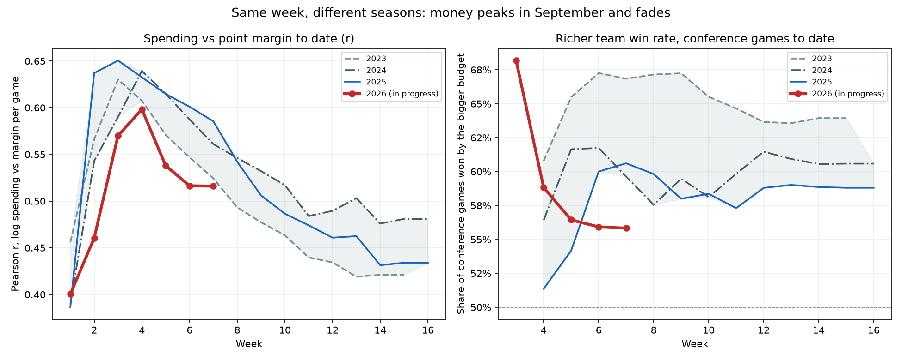

## 2. Does money buy wins?

### Spending versus revenue: which one tracks winning?

Revenue is money **coming in** and partly a *reward* for winning (tickets, donations, playoff payouts). Spending is money **going out** and closer to an *input* the program controls.

In practice they are nearly the same variable: log revenue and log spending correlate at **0.96**, so every money metric below tells essentially the same story. The table shows correlations with each outcome; the full table with p-values and Spearman rank correlations is in `data/processed/correlations_<season>.csv`.

| Money metric | n | Margin/g | Win% | Pts/g | Allowed/g |
| --- | ---: | ---: | ---: | ---: | ---: |
| 247 team talent composite | 19 | +0.58** | +0.54* | +0.49* | -0.40 |
| Men's coaching payroll | 135 | +0.52*** | +0.45*** | +0.46*** | -0.41*** |
| Football non-operating spend | 135 | +0.52*** | +0.43*** | +0.46*** | -0.40*** |
| Athletics dept revenue | 135 | +0.52*** | +0.42*** | +0.44*** | -0.41*** |
| Football revenue | 135 | +0.52*** | +0.42*** | +0.44*** | -0.41*** |
| Men's recruiting spend | 135 | +0.52*** | +0.46*** | +0.46*** | -0.39*** |
| Football expenses | 135 | +0.52*** | +0.42*** | +0.46*** | -0.39*** |
| Athletics dept expenses | 135 | +0.51*** | +0.42*** | +0.44*** | -0.41*** |
| Football spend per player | 135 | +0.50*** | +0.41*** | +0.45*** | -0.38*** |
| Avg men's head coach salary | 135 | +0.50*** | +0.42*** | +0.45*** | -0.38*** |
| Head coach total pay | 52 | +0.15 | +0.03 | -0.14 | -0.38** |

Money columns are log-scaled except the talent composite. `*` p<0.05, `**` p<0.01, `***` p<0.001.

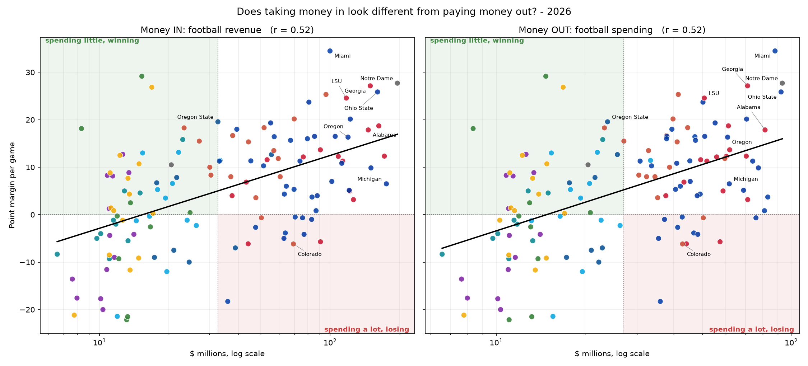

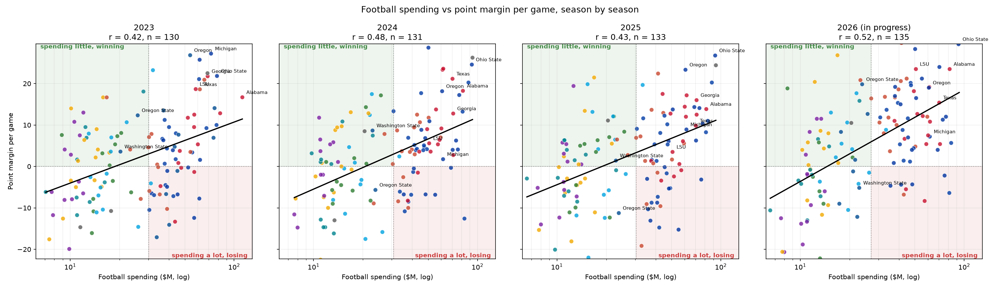

### Budget tiers: the shape of the curve

A correlation says the relationship exists; the tiers show its shape. Teams are ranked into fifths by budget within each season, so tier 1 is always the poorest fifth of that year's FBS.

| Tier | Median budget | Win% (completed) | Margin/g (completed) | Win% (2026) | Margin/g (2026) | Team-seasons |
| --- | ---: | ---: | ---: | ---: | ---: | ---: |
| 1 (poorest fifth) | $11.0M | 43.9% | -3.7 | 40.7% | -3.9 | 80 |
| 2 (second fifth) | $15.2M | 48.4% | -0.5 | 51.1% | +1.2 | 78 |
| 3 (middle fifth) | $30.4M | 49.6% | +0.7 | 56.3% | +5.7 | 79 |
| 4 (fourth fifth) | $43.3M | 56.5% | +3.8 | 64.3% | +8.8 | 78 |
| 5 (richest fifth) | $62.0M | 66.7% | +10.8 | 68.2% | +13.4 | 79 |

Over completed seasons the poorest fifth (median $11.0M) wins 43.9% of its games and the richest fifth ($62.0M) wins 66.7%: a 15-point swing in margin per game. The curve is convex: the middle three tiers sit within 4.3 points of each other, then the richest fifth jumps +7.0 points clear of the next tier. Money buys most at the very top, where the budget pays for the depth that wins the back half of a schedule.

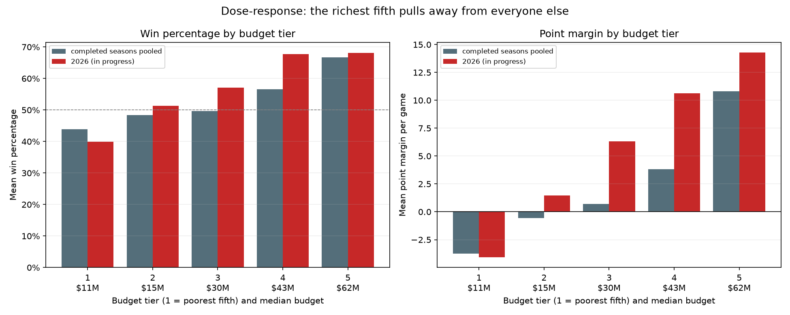

### Where the money edge is won: in or out of conference

The national correlation blends two different contests: **non-conference** games (often Power 4 vs Group of Five budgets) and **conference** games (peers sharing media revenue).

| Season | Non-conf FBS games | Richer team wins | Conf games | Richer team wins | Conf r, absolute $ | Conf r, $ vs league |
| ---: | ---: | ---: | ---: | ---: | ---: | ---: |
| 2023 | 202 | 71.8% | 541 | 63.9% | +0.15 | +0.35 |
| 2024 | 212 | 78.2% | 540 | 60.6% | +0.16 | +0.41 |
| 2025 | 203 | 74.2% | 559 | 58.8% | +0.12 | +0.34 |
| 2026 (in progress) | 170 | 77.4% | 218 | 55.8% | +0.10 | +0.29 |

Across completed seasons the bigger budget wins **74.7%** of non-conference FBS games but only **61.1%** of conference games. Inside a conference, raw dollars barely track margin (r = +0.14), whereas spending *relative to the league median* does (r = +0.36).

FCS games are excluded above; FBS teams won them by an average of **+32.0 points**.

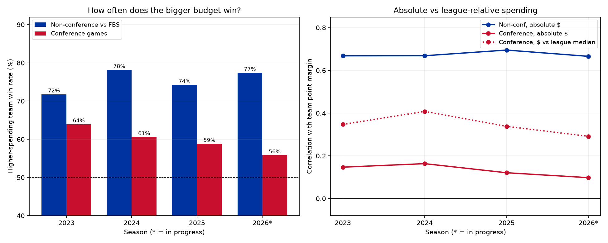

### Within the league: out-spending your peers

Re-expressing spending as a multiple of the conference median and margin as points above the conference mean removes the SEC-vs-MAC gap to test whether *out-spending your own league* pays:

| Season | n | National r (absolute $) | Within-league r (relative $) | p (within) |
| --- | ---: | ---: | ---: | ---: |
| 2023 | 127 | +0.40 | +0.42 | 7e-07 |
| 2024 | 128 | +0.46 | +0.45 | 8e-08 |
| 2025 | 131 | +0.42 | +0.36 | 3e-05 |
| 2026 (in progress) | 133 | +0.51 | +0.30 | 0.0004 |

Over full seasons, out-spending your conference predicts margin as well as raw dollars do nationally (within r = +0.41 vs national +0.43).

**Biggest spenders relative to their Power 4 league**

| Program | Conf | Football exp | x league median | Record | Margin/g |
| --- | --- | ---: | ---: | :---: | ---: |
| Miami | ACC | $88.1M | 2.06x | 6-0 | +34.5 |
| Florida State | ACC | $83.3M | 1.95x | 3-4 | +3.7 |
| Clemson | ACC | $81.1M | 1.90x | 4-2 | +0.8 |
| Ohio State | Big Ten | $92.4M | 1.74x | 6-1 | +25.9 |
| TCU | Big 12 | $59.6M | 1.56x | 3-3 | +11.8 |
| Penn State | Big Ten | $77.4M | 1.46x | 3-4 | +9.9 |

**Smallest spenders relative to their Power 4 league**

| Program | Conf | Football exp | x league median | Record | Margin/g |
| --- | --- | ---: | ---: | :---: | ---: |
| Houston | Big 12 | $23.3M | 0.61x | 6-1 | +18.3 |
| Mississippi State | SEC | $37.6M | 0.65x | 4-2 | +4.0 |
| Maryland | Big Ten | $35.5M | 0.67x | 2-5 | -5.0 |
| Purdue | Big Ten | $37.2M | 0.70x | 3-4 | -1.0 |
| Kansas State | Big 12 | $27.1M | 0.71x | 4-2 | +15.5 |
| Northwestern | Big Ten | $37.9M | 0.71x | 5-1 | +16.5 |

OLS with 10 conference fixed effects (outcome **win_pct**, n = 135, R² = 0.209, adjusted 0.138):

| Term | Estimate | Std error | t | p |
| --- | ---: | ---: | ---: | ---: |
| log10(football_expenses) | +0.5078 | 0.1666 | +3.05 | 0.0028** |

Doubling the football budget within the same conference adds **+15.3 percentage points of win rate** (log10(2) = 0.301).

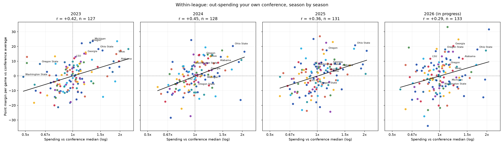

## 3. What separates good teams from bad

### Last season versus this budget

Before crediting the budget, compare it with the simplest baseline: last season's point margin.

| Season | n | r, last season's margin | r, football spending |
| --- | ---: | ---: | ---: |
| 2024 | 130 | +0.53 | +0.47 |
| 2025 | 131 | +0.56 | +0.43 |
| 2026 (in progress) | 133 | +0.53 | +0.53 |

Pooling 2024-2025, last season alone explains **30%** of margin variance, spending alone **20%**, and both together **35%**. Both remain significant in a joint model (t = 7.6 for prior margin, 4.5 for spending): each point of prior margin carries 0.44 points forward, and doubling the budget adds **+2.8 points per game** on top.

In 2026 to date, prior margin (+0.53) and spending (+0.53) are dead even as conference play replaces September mismatches.

### Who beats their budget year after year

Each team gets a seasonal residual: actual point margin minus the margin expected for its budget. If beating the budget were pure luck, residuals would not correlate year to year.

| Season | n | r with previous season's residual |
| --- | ---: | ---: |
| 2024 | 130 | +0.41 |
| 2025 | 131 | +0.45 |
| 2026 (in progress) | 133 | +0.39 |

Across completed seasons the residual repeats at r = **+0.43** (~4 points carried over per 10 points of prior over-performance), capturing coaching, player development, scheme, and off-books NIL.

**Consistently beating their budget (points per game)**

| Program | Conf | Football exp | 2023 | 2024 | 2025 | Average | 2026 to date |
| --- | --- | ---: | ---: | ---: | ---: | ---: | ---: |
| James Madison | Sun Belt | $16.9M | +17.7 | +14.6 | +22.2 | **+18.2** | +25.7 |
| Toledo | MAC | $12.6M | +15.8 | +9.1 | +22.2 | **+15.7** | +14.1 |
| Oregon | Big Ten | $60.8M | +20.1 | +10.0 | +15.2 | **+15.1** | +4.1 |
| Notre Dame | FBS Independents | $93.3M | +14.2 | +14.9 | +13.3 | **+14.1** | +11.7 |
| Ohio State | Big Ten | $92.4M | +12.7 | +13.3 | +15.7 | **+13.9** | +10.0 |
| SMU | ACC | $45.3M | +19.8 | +11.8 | +6.1 | **+12.6** | +1.6 |
| Ohio | MAC | $10.8M | +10.7 | +16.7 | +9.6 | **+12.3** | +11.0 |
| Memphis | American | $22.0M | +9.6 | +12.0 | +11.0 | **+10.9** | +9.7 |

**Consistently missing their budget (points per game)**

| Program | Conf | Football exp | 2023 | 2024 | 2025 | Average | 2026 to date |
| --- | --- | ---: | ---: | ---: | ---: | ---: | ---: |
| Purdue | Big Ten | $37.2M | -9.8 | -28.6 | -17.8 | **-18.7** | -9.0 |
| Stanford | ACC | $36.0M | -20.8 | -15.0 | -14.8 | **-16.9** | -26.0 |
| Kent State | MAC | $10.4M | -15.8 | -25.0 | -8.2 | **-16.3** | -16.9 |
| Massachusetts | MAC | $13.4M | -11.6 | -9.7 | -25.1 | **-15.5** | +9.7 |
| Michigan State | Big Ten | $48.2M | -19.5 | -13.1 | -11.9 | **-14.8** | -14.4 |
| Charlotte | American | $15.6M | -9.4 | -9.3 | -20.7 | **-13.1** | -21.9 |
| Temple | American | $26.3M | -16.7 | -17.6 | -4.2 | **-12.8** | -7.3 |
| Oklahoma State | Big 12 | $32.8M | -3.3 | -11.9 | -23.0 | **-12.8** | +6.6 |

Over-performers span budgets from Ohio and Toledo ($12.6M or less) to Notre Dame and Ohio State ($92.4M or more).

### On-field markers of a good team

Which on-field numbers separate winners from losers, and which of them does money buy? Each season stat is correlated with point margin and with football spending, pooling completed seasons (n = 393 team-seasons).

| Stat | r with point margin | r with spending |
| --- | ---: | ---: |
| Passer rating (offense) | +0.73 | +0.34 |
| Yards per carry (offense) | +0.57 | +0.16 |
| Sacks (defense) | +0.56 | +0.24 |
| Completion % (offense) | +0.55 | +0.31 |
| Rush yards per game (offense) | +0.53 | +0.10 |
| Interceptions caught (defense) | +0.50 | +0.14 |
| Tackles for loss (defense) | +0.48 | +0.15 |
| Interceptions thrown (offense) | -0.46 | -0.21 |
| Pass yards per game (offense) | +0.37 | +0.23 |
| Fumbles lost (offense) | -0.21 | -0.13 |

**Passer rating** is the clearest marker of a good team (r = +0.73), yet spending explains it only loosely (r = +0.34). The widest gap is rush yards per game: r = +0.53 with margin but +0.10 with spending. Every marker tracks winning more tightly than it tracks spending: money buys a better roster at the margin, but what the roster does on the field is mostly something else.

These are symptoms of a good team rather than independent causes: teams that lead run the ball late, and good defenses force interceptions.

> [!NOTE]
> Richer teams also play **tougher schedules**: spending correlates r = +0.41 with opponents' win percentage. Raw point margin therefore slightly *understates* what money buys.

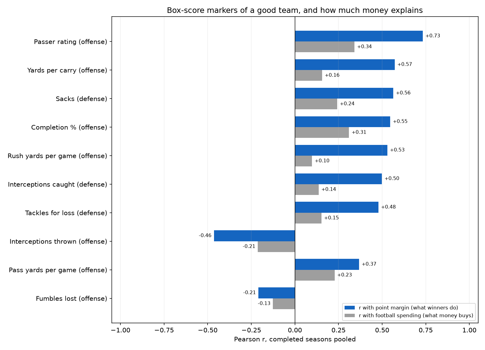

### Which spending line matters?

Each spending line is added to a regression that already controls for total football budget (|t| > 2 indicates independent signal):

| Spending line | n | Corr. with total budget | r with margin alone | Added coef (pts per SD) | t | R² gain |
| --- | ---: | ---: | ---: | ---: | ---: | ---: |
| Men's coaching payroll | 135 | 0.94 | +0.52 | +3.9 | +1.5 | +0.013 |
| Avg men's head coach salary | 135 | 0.84 | +0.50 | +2.6 | +1.6 | +0.014 |
| Avg men's assistant coach salary | 135 | 0.90 | +0.51 | +3.1 | +1.5 | +0.013 |
| Men's recruiting spend | 135 | 0.92 | +0.52 | +3.2 | +1.5 | +0.012 |
| Football game-day operations | 135 | 0.84 | +0.42 | -0.6 | -0.3 | +0.001 |
| Head coach total pay | 52 | 0.77 | +0.15 | +1.2 | +0.6 | +0.007 |

Every component correlates **0.77 or higher** with total budget, and none is significant once total budget is held fixed (max |t| = 1.6, Avg men's head coach salary). Rich programs spend across the board, so overall scale—not a single line item—drives the correlation.

#### What the head coach is paid

Verified total pay is on file for **52 of 138 teams**. Public universities subject to open-records laws provide high-confidence, cited figures. Private institutions (e.g., USC, Notre Dame, Stanford, Miami, TCU, Baylor, SMU, Vanderbilt) are exempt from FOIA disclosure and remain marked as unverified with blank salaries rather than synthetic estimates.

Across those 52 teams, head coach pay correlates **r = +0.15** with point margin per game (p = 0.275), weaker than total spending. Part of that is the sample: 92% of the verified rows are Power 4 schools, which squeezes the spread in both pay and results. With the total budget in the model, coach pay adds nothing (see the spending-line table above).

| Coach | School | Total pay | Buyout | Win% | Point margin |
| --- | --- | ---: | ---: | ---: | ---: |
| Kirby Smart | Georgia | $13.3M | $105.1M | 85.7% | +27.1 |
| Ryan Day | Ohio State | $12.6M | $70.9M | 85.7% | +25.9 |
| Dabo Swinney | Clemson | $11.4M | $60.0M | 66.7% | +0.8 |
| Steve Sarkisian | Texas | $10.8M | $60.3M | 66.7% | +12.3 |
| Dan Lanning | Oregon | $10.4M | $56.7M | 66.7% | +16.3 |
| Kalen DeBoer | Alabama | $10.2M | $60.8M | 71.4% | +17.9 |
| Brian Kelly | LSU | $10.2M | $53.3M | 71.4% | +24.6 |
| Bill Belichick | North Carolina | $10.1M | $20.8M | 66.7% | +4.3 |
| Josh Heupel | Tennessee | $9.0M | $37.5M | 85.7% | +18.7 |
| Mark Stoops | Kentucky | $9.0M | $37.7M | 85.7% | +6.9 |

### Does getting richer help?

The cross-section says rich programs win. Does *getting* richer help? Comparing each school's 2023 and 2025 seasons (median budget change +7%), the budget change is unrelated to the margin change: r = **-0.05** (p = 0.59, n = 130).

Money appears to work through program scale built over many years - facilities, staff depth, recruiting pipelines - rather than a one-year raise. Two years of filings is a short window, so treat this as "no quick payoff yet" rather than "no payoff".

## 4. Luck, close games and crowds

### Luck: records that outrun the scoring

A team's record should follow its scoring. The Pythagorean expectation turns points for and against into an expected win percentage; the gap to the actual record is mostly the bounce of close games, and the question is whether the budget buys any of it.

| Season | Teams | r, expected vs actual win% | r, luck vs log budget | p |
| --- | ---: | ---: | ---: | ---: |
| 2023 | 130 | +0.92 | -0.04 | 0.63 |
| 2024 | 131 | +0.90 | -0.13 | 0.15 |
| 2025 | 133 | +0.91 | -0.25 | <0.01 |
| 2026 (in progress) | 135 | +0.85 | -0.15 | 0.09 |

Scoring explains the record well (r = +0.91 in completed seasons), so the residual is small but real. Luck does not follow the budget: luck correlates -0.14 with log spending across completed seasons, significant in 1 of 3. Whatever money buys, it is not the bounce of the ball.

**Luckiest and unluckiest records so far in 2026**

| Group | Program | Conf | Football exp | Record | Expected win% | Actual | Wins above expectation |
| --- | --- | --- | ---: | :---: | ---: | ---: | ---: |
| Lucky | Stanford | ACC | $36.0M | 3-4 | 16.2% | 42.9% | **+1.9** |
| Lucky | UTSA | American | $17.9M | 6-1 | 60.4% | 85.7% | **+1.8** |
| Lucky | Kentucky | SEC | $43.3M | 6-1 | 63.6% | 85.7% | **+1.5** |
| Lucky | Marshall | Sun Belt | $13.6M | 3-3 | 26.7% | 50.0% | **+1.4** |
| Lucky | Kent State | MAC | $10.4M | 2-5 | 8.9% | 28.6% | **+1.4** |
| Unlucky | Penn State | Big Ten | $77.4M | 3-4 | 73.0% | 42.9% | **-2.1** |
| Unlucky | TCU | Big 12 | $59.6M | 3-3 | 83.3% | 50.0% | **-2.0** |
| Unlucky | Kansas | Big 12 | $34.5M | 2-4 | 66.4% | 33.3% | **-2.0** |
| Unlucky | Kennesaw State | Conference USA | $11.5M | 1-5 | 47.0% | 16.7% | **-1.8** |
| Unlucky | Syracuse | ACC | $42.1M | 2-4 | 62.2% | 33.3% | **-1.7** |

Stanford is 3-4 while scoring like a team that wins 16.2% of its games; Penn State is 3-4 while scoring like one that wins 73.0%. Records like these tend to regress toward the scoring over the rest of the season.

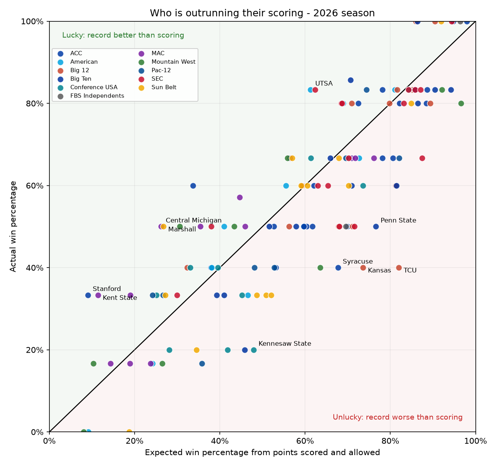

### Close games versus blowouts

Does the bigger budget win the tight games, or only the lopsided ones? Every FBS-vs-FBS game is split by its final margin: one-score (8 points or fewer) against blowouts (17 or more). Each season is counted through week 7.

| Season | FBS games | Richer team wins | One-score games | Richer wins (one-score) | Blowouts | Richer wins (blowouts) |
| --- | ---: | ---: | ---: | ---: | ---: | ---: |
| 2023 | 358 | 68.3% | 125 (34.9%) | 64.0% | 165 | 80.6% |
| 2024 | 334 | 69.5% | 130 (38.9%) | 58.5% | 155 | 79.4% |
| 2025 | 338 | 68.0% | 118 (34.9%) | 50.8% | 158 | 81.6% |
| 2026 (in progress) | 374 | 65.5% | 137 (36.6%) | 50.4% | 165 | 76.4% |

Across completed seasons the bigger budget wins **80.5%** of blowouts but only **57.8%** of one-score games. Money shows up as depth and talent that turn a close game into a comfortable one; once a game is actually close, the budget is nearly irrelevant to who wins it.

So far in 2026, 36.6% of FBS games have been one-score games against 36.2% at the same point of past seasons, and the richer side has won 50.4% of them (n = 137).

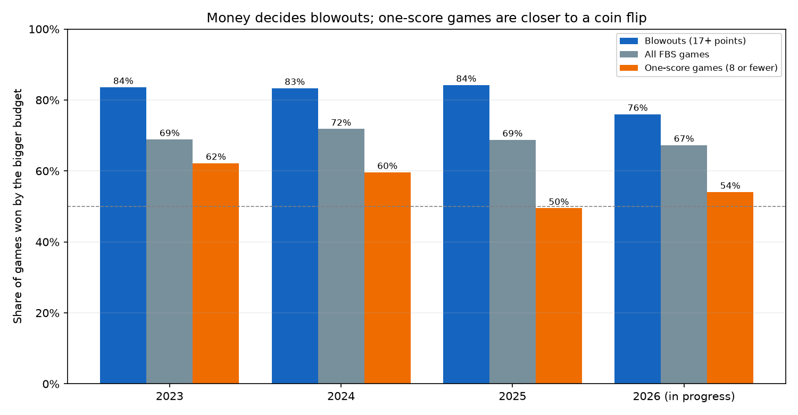

### Home field: does money buy a louder stadium?

Home advantage is measured within each team (its home margin minus its away margin against FBS opponents, neutral sites excluded) so a rich team's stronger roster is not mistaken for a louder stadium.

| Season | Home games | Home win rate | Home margin | Within-team home edge | r, home edge vs log budget | p |
| --- | ---: | ---: | ---: | ---: | ---: | ---: |
| 2023 | 350 | 61.1% | +5.1 | +8.2 | +0.20 | 0.02 |
| 2024 | 326 | 59.2% | +6.0 | +9.1 | -0.18 | 0.04 |
| 2025 | 332 | 63.9% | +7.9 | +13.5 | -0.23 | <0.01 |
| 2026 (in progress) | 367 | 62.1% | +7.3 | +13.1 | -0.07 | 0.41 |

The home side wins about 61.4% of games and teams average 10 points better at home than away, but that edge is unrelated to budget (mean r = -0.07, sign flipping year to year): a 100,000-seat stadium does not widen the home-field margin over a 25,000-seat one.

### Crowds: the live money signal

Attendance is the one scale metric that arrives live each week instead of two years late in a federal filing. Average home crowd per team (neutral sites excluded):

| Season | Teams | Mean home crowd | Median | r, log crowd vs log budget | r, log crowd vs margin |
| --- | ---: | ---: | ---: | ---: | ---: |
| 2023 | 130 | 40,959 | 35,961 | +0.89 | +0.49 |
| 2024 | 131 | 40,657 | 34,623 | +0.89 | +0.51 |
| 2025 | 133 | 40,593 | 32,215 | +0.88 | +0.48 |
| 2026 (in progress) | 135 | 40,195 | 32,922 | +0.88 | +0.54 |

Log crowd size and log budget correlate at r = **+0.88**. Using *last* season's crowd (known before kickoff), crowd and budget predict margin almost equally over 2024-2025 (r = +0.44 vs +0.45, n = 261); in a joint model the budget keeps the edge (t = 2.5 for budget, 1.4 for crowd).

**Are crowds growing?** Same-week comparison (through week 7), mean home crowd across FBS: 2023: 41,219 > 2024: 40,896 > 2025: 40,896 > 2026: 39,949. School by school, the median change from 2025 is **-0.2%** (down, n = 136).

**Biggest crowd gains versus 2025**

| Program | Home games | 2025 crowd | 2026 crowd | Change |
| --- | ---: | ---: | ---: | ---: |
| Northwestern | 4 | 11,429 | 20,556 | **+80%** |
| Sam Houston | 2 | 5,628 | 9,736 | **+73%** |
| Massachusetts | 4 | 8,431 | 14,534 | **+72%** |
| New Mexico State | 3 | 9,796 | 13,242 | **+35%** |
| Miami (OH) | 4 | 11,564 | 15,074 | **+30%** |
| Northern Illinois | 2 | 12,636 | 16,437 | **+30%** |

**Biggest crowd losses versus 2025**

| Program | Home games | 2025 crowd | 2026 crowd | Change |
| --- | ---: | ---: | ---: | ---: |
| Eastern Michigan | 4 | 16,453 | 7,882 | **-52%** |
| Buffalo | 4 | 14,456 | 8,132 | **-44%** |
| Louisiana Tech | 3 | 30,070 | 17,156 | **-43%** |
| Rice | 4 | 25,125 | 15,187 | **-40%** |
| South Alabama | 3 | 15,979 | 10,533 | **-34%** |
| Texas State | 4 | 25,650 | 19,002 | **-26%** |

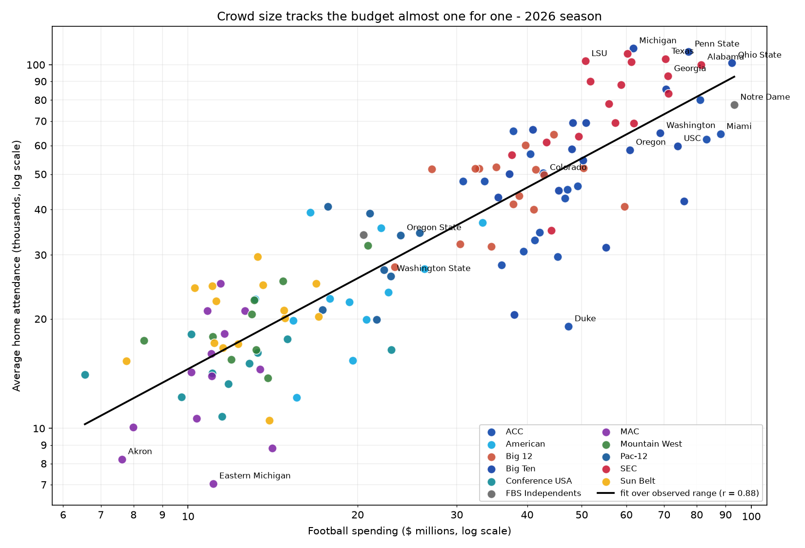

## 5. Realignment and travel

### What happened to the schools that switched conference

Between 2023 and 2026 the sport redrew its map: **24 schools changed conference**. That is the closest thing this data has to a controlled experiment, because the money moved for reasons unrelated to recent on-field performance.

> [!IMPORTANT]
> Federal finance filings lag by two years, so 2024 is the newest money year on record. Schools that moved in 2024 have **one** post-move budget year (some, like Texas, show a 1-year dip off a pre-move 2023 contribution spike); 2026 movers have **none** and are left blank rather than filled with pre-move figures. On-field margin changes compare seasons before versus from the move year onward (including 2026 to date).

#### The Pac-12 breakup

Ten of the twelve 2023 Pac-12 members left. Two did not, and the gap between those two groups is the single starkest result in this project.

| School | Role | Football revenue before | After | Change | Point margin change |
| --- | --- | ---: | ---: | ---: | ---: |
| Arizona | left | $37.1M | $37.8M | +1.8% | -6.7 |
| Arizona State | left | $40.2M | $50.4M | +25.4% | +18.3 |
| California | left | $45.1M | $64.0M | +41.9% | +0.5 |
| Colorado | left | $64.7M | $69.3M | +7.2% | +5.6 |
| Oregon | left | $109.2M | $119.6M | +9.5% | -7.6 |
| Stanford | left | $33.7M | $36.0M | +6.7% | +3.9 |
| UCLA | left | $45.8M | $55.2M | +20.6% | -8.6 |
| USC | left | $74.9M | $74.0M | -1.1% | +3.6 |
| Utah | left | $72.8M | $95.9M | +31.8% | +12.1 |
| Washington | left | $127.8M | $121.0M | -5.3% | -7.7 |
| Oregon State | stayed behind | $47.4M | $32.6M | -31.2% | -11.4 |
| Washington State | stayed behind | $57.0M | $38.8M | -31.9% | -2.6 |
| Boise State | joined new Pac-12 | $41.1M | - | n/a | +1.5 |
| Colorado State | joined new Pac-12 | $19.6M | - | n/a | -2.4 |
| Fresno State | joined new Pac-12 | $18.3M | - | n/a | +2.2 |
| San Diego State | joined new Pac-12 | $27.5M | - | n/a | -9.2 |
| Texas State | joined new Pac-12 | $18.0M | - | n/a | +1.0 |
| Utah State | joined new Pac-12 | $17.4M | - | n/a | -8.3 |

Median revenue change for the schools that left: **+8.3%**. For the two left behind: **-31.6%**. Washington State and Oregon State lost roughly a third of their football revenue simply by losing their conference.

##### Realignment financial mechanics

Several leavers show modest 2024 revenue gains because they entered on reduced media shares (Oregon and Washington joined the Big Ten at ~$30M/yr vs ~$65M+ full shares for USC and UCLA) while absorbing exit settlements and cross-country travel costs:

| Financial impact | Reported figure | Scope | Confidence | Source |
| :--- | :--- | :--- | :--- | :--- |
| WSU/OSU Settlement | $65M Withheld | 10 Departing Schools | High | [The Athletic](https://theathletic.com/5155122/2023/12/21/pac-12-settlement-washington-state-oregon-state/) |
| B1G Media Deal | ~$1.1 - $1.2B/yr | Big Ten | High | [CBS Sports](https://www.cbssports.com/college-football/news/big-ten-reaches-seven-year-media-rights-deal-with-cbs-fox-and-nbc-worth-more-than-7-billion/) |
| Big 12 Media Deal | ~$380M/yr | Big 12 | High | [ESPN](https://www.espn.com/college-football/story/_/id/34907937/big-12-agrees-new-media-rights-deal-espn-fox-sports) |
| USC / UCLA B1G Share | Full Share (~$65M+) | USC, UCLA | High | [LA Times](https://www.latimes.com/sports/ucla/story/2022-06-30/ucla-usc-big-ten-conference-move) |
| Oregon / UW B1G Share | $30M, +$1M/yr | Oregon, Washington | High | [ESPN](https://www.espn.com/college-football/story/_/id/38135860/oregon-washington-join-big-ten-2024) |
| Increased Travel Costs | $4.6M to $5.8M | UCLA | High | [LA Times](https://www.latimes.com/sports/ucla/story/2022-12-14/ucla-big-ten-move-uc-regents-approval-travel-costs) |

#### The other schools that moved

| School | Move | Effective | Revenue change | Point margin change |
| --- | --- | ---: | ---: | ---: |
| Army | FBS Independents to American | 2024 | not yet filed | +10.7 |
| Oklahoma | Big 12 to SEC | 2024 | +1.1% | -14.8 |
| SMU | American to ACC | 2024 | +41.8% | -9.5 |
| Texas | Big 12 to SEC | 2024 | -14.4% | -4.2 |
| Massachusetts | FBS Independents to MAC | 2025 | not yet filed | +4.5 |
| Louisiana Tech | Conference USA to Sun Belt | 2026 | not yet filed | +8.7 |
| Northern Illinois | MAC to Mountain West | 2026 | not yet filed | -22.4 |
| UTEP | Conference USA to Mountain West | 2026 | not yet filed | -12.6 |

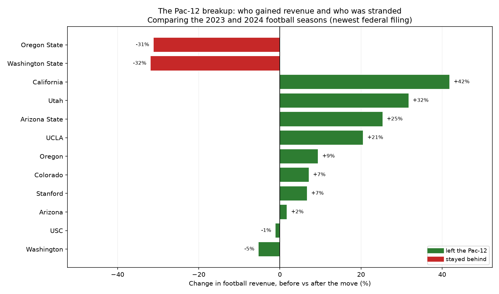

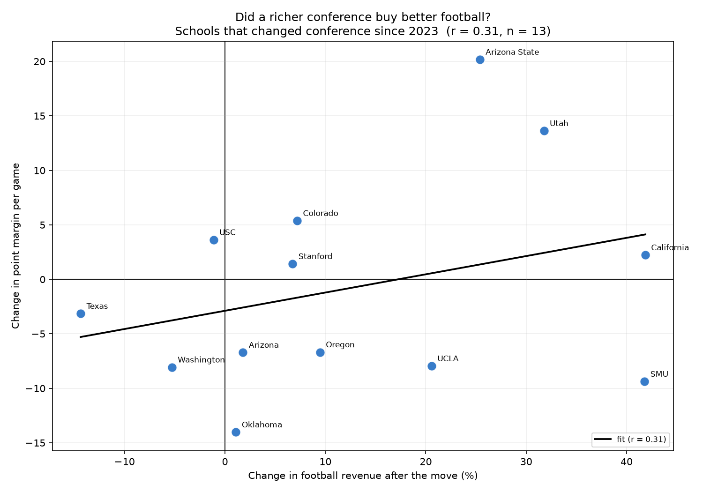

### Travel, time zones and the cost of flying east

Realignment moved miles as well as money. A team flying east loses hours: a noon kickoff on the east coast is a 9am body clock for a team from California. The table below pools every completed game from 2023 to 2026 by how many time zones the team crossed.

| Travel | Games | Mean margin | Win rate |
| --- | ---: | ---: | ---: |
| 3 zones west | 61 | -0.8 | 44% |
| 2 zones west | 81 | -6.1 | 42% |
| 1 zone west | 439 | -5.8 | 37% |
| same zone | 1427 | -5.2 | 42% |
| 1 zone east | 425 | -3.7 | 42% |
| 2 zones east | 85 | -8.2 | 36% |
| 3 zones east | 64 | -7.8 | 38% |

> [!IMPORTANT]
> The raw split above is confounded. The teams that fly two or more zones east are disproportionately Group of Five programs taking a paycheque game at a blue blood, so they would have lost anyway. Comparing each team against **itself** - its own margin on long eastward trips versus its own margin on every other away game - the penalty is **-0.6 points** across 73 team-seasons (-4.7 on long eastward trips versus -4.1 on other away games).

#### Who now travels further

Average time zones crossed per away game, before and after the move. The old Pac-12 fit inside two zones; the Big Ten and ACC do not. Home margin is the control: a tougher new league lowers both, while a travel burden should only show up on the road.

| School | Move | Zones before | Zones after | Away margin change | Home margin change | Road gap change |
| --- | --- | ---: | ---: | ---: | ---: | ---: |
| Stanford | Pac-12 to ACC | -0.20 | +2.07 | -9.3 | +17.3 | -26.6 |
| Arizona State | Pac-12 to Big 12 | -0.75 | +0.85 | +13.2 | +24.1 | -10.9 |
| Colorado State | Mountain West to Pac-12 | -0.44 | +1.00 | -15.8 | +2.5 | -18.2 |
| California | Pac-12 to ACC | +0.50 | +1.92 | -2.3 | +3.1 | -5.3 |
| Colorado | Pac-12 to Big 12 | -0.33 | +1.00 | +9.1 | +3.4 | +5.7 |
| UCLA | Pac-12 to Big Ten | +0.33 | +1.47 | -10.3 | -14.9 | +4.6 |
| Washington | Pac-12 to Big Ten | +0.80 | +1.83 | -15.5 | -2.4 | -13.0 |
| Arizona | Pac-12 to Big 12 | -0.33 | +0.69 | -15.3 | -4.1 | -11.1 |
| USC | Pac-12 to Big Ten | +1.00 | +2.00 | +2.8 | +3.7 | -0.8 |
| Utah | Pac-12 to Big 12 | -0.40 | +0.57 | +17.3 | +6.4 | +10.9 |
| Oregon | Pac-12 to Big Ten | +0.80 | +1.67 | -3.9 | -13.7 | +9.8 |
| Texas | Big 12 to SEC | +0.00 | +0.60 | -10.9 | -0.2 | -10.7 |
| San Diego State | Mountain West to Pac-12 | +0.41 | +1.00 | -22.4 | -0.5 | -21.9 |

Pooled over these 13 schools, away margin moved **-4.9** and home margin **+1.9** points per game. The road gap averaged -6.8 with 9 of 13 schools negative, but a one-sample t-test gives p = 0.07: few games per school and different opponents each year make this suggestive, not conclusive.

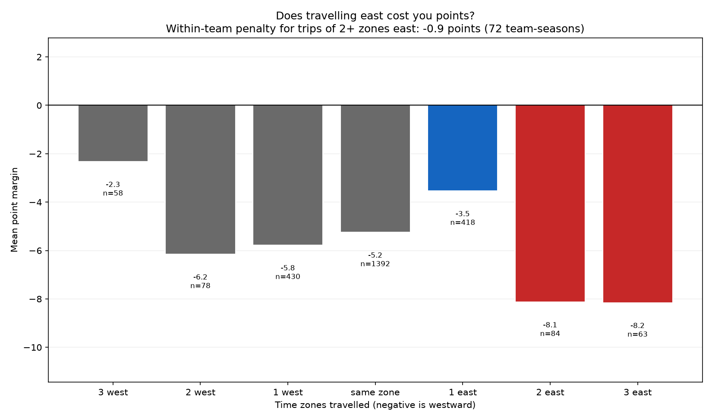

## 6. Roster economics: NIL and revenue sharing

Under the *House v. NCAA* settlement, schools may share up to ~$20.5M in athletics revenue with athletes in 2025-26 (~$21.32M in 2026-27).

> [!IMPORTANT]
> Revenue-sharing caps and 247Sports talent composites are public, but **per-school football allocations and NIL collective payrolls remain undisclosed.** Rather than fabricating synthetic estimates, per-school allocation (`football_allocation_est`) and roster payroll (`roster_payroll_est`) columns remain blank (`n/a`) until audited disclosures exist.

| Data point | Reported figure | Scope | Confidence | Source |
| :--- | :--- | :--- | :--- | :--- |
| Revenue-share cap | ~$20.5M (25-26), ~$21.32M (26-27) | Every school | High | [ESPN](https://www.espn.com/college-sports/story/_/id/40206364/ncaa-power-conferences-agree-settle-house-vs-ncaa-lawsuit) |
| Football share of cap | ~75% | League-wide rule of thumb | Low per school | [Yahoo Sports](https://sports.yahoo.com/college-sports-revenue-sharing-model/) |
| Collective budgets | $15M-$20M+ | Elite tier only | Medium | [On3](https://www.on3.com/nil/news/college-football-nil-collective-budgets/) |
| Roster valuations | $12M-$15M+ | Top 5 rosters | Medium | [On3](https://www.on3.com/nil/rankings/player/college/football/) |
| 2026 recruiting spend | $3M-$5M | Top 15 classes | Medium | [247Sports](https://247sports.com/college-football/recruiting/) |
| Per-school football allocation | not disclosed | — | — | — |

### Talent composite and the equal-cap paradox

Because the House revenue-share cap is uniform across institutions, nearly every Power 4 program will max out the same ~$16M football share. Competitive differentiation therefore shifts to third-party NIL collectives ($15M-$20M+ at top programs) and uncapped coaching, recruiting, and support budgets.

247Sports Team Talent Composite ratings are on file for **19 elite programs** only. Among them, talent tracks scoring (r = +0.486 with points per game, p = 0.035). With so few schools, all from the top of the sport, treat this as a hint rather than a result.

## 7. Reference tables

### The richest programs and what they have done

| # | Program | Conf | Football rev | Football exp | Dept rev | Record | Win% | Margin/g |
| ---: | --- | --- | ---: | ---: | ---: | :---: | ---: | ---: |
| 1 | Notre Dame | FBS Independents | $195.7M | $93.3M | $289.6M | 6-1 | 85.7% | +27.7 |
| 2 | Michigan | Big Ten | $175.3M | $61.7M | $236.4M | 4-2 | 66.7% | +6.5 |
| 3 | Texas | SEC | $171.9M | $70.4M | $343.1M | 4-2 | 66.7% | +12.3 |
| 4 | Tennessee | SEC | $162.5M | $61.2M | $285.4M | 6-1 | 85.7% | +18.7 |
| 5 | Ohio State | Big Ten | $160.5M | $92.4M | $295.3M | 6-1 | 85.7% | +25.9 |
| 6 | Penn State | Big Ten | $150.3M | $77.4M | $254.4M | 3-4 | 42.9% | +9.9 |
| 7 | Georgia | SEC | $149.3M | $71.1M | $233.5M | 6-1 | 85.7% | +27.1 |
| 8 | Alabama | SEC | $146.3M | $81.5M | $244.6M | 5-2 | 71.4% | +17.9 |
| 9 | Oklahoma | SEC | $126.2M | $71.2M | $234.4M | 3-3 | 50.0% | +3.2 |
| 10 | Nebraska | Big Ten | $122.3M | $70.6M | $205.8M | 5-2 | 71.4% | +20.1 |
| 11 | Auburn | SEC | $121.4M | $58.7M | $205.3M | 4-2 | 66.7% | +5.0 |
| 12 | Washington | Big Ten | $121.0M | $68.9M | $178.4M | 4-3 | 57.1% | +5.1 |
| 13 | Oregon | Big Ten | $119.6M | $60.8M | $167.1M | 4-2 | 66.7% | +16.3 |
| 14 | LSU | SEC | $117.6M | $50.7M | $223.5M | 5-2 | 71.4% | +24.6 |
| 15 | Florida | SEC | $113.4M | $51.8M | $199.2M | 5-2 | 71.4% | +11.3 |
| 16 | Wisconsin | Big Ten | $112.3M | $40.9M | $190.5M | 4-2 | 66.7% | +10.8 |
| 17 | Texas A&M | SEC | $108.5M | $60.2M | $235.5M | 4-3 | 57.1% | +12.3 |
| 18 | Iowa | Big Ten | $105.2M | $50.9M | $180.0M | 5-1 | 83.3% | +16.5 |
| 19 | Minnesota | Big Ten | $101.7M | $45.5M | $156.8M | 4-2 | 66.7% | +7.0 |
| 20 | Miami | ACC | $99.9M | $88.1M | $230.5M | 6-0 | 100.0% | +34.5 |

### Conference summary

| Conference | Teams | Median football exp | Median football rev | Median dept rev | Mean win% | Mean margin |
| --- | ---: | ---: | ---: | ---: | ---: | ---: |
| SEC | 16 | $58.0M | $110.9M | $204.9M | 66.8% | +10.5 |
| FBS Independents | 2 | $56.9M | $108.1M | $193.3M | 67.9% | +19.1 |
| Big Ten | 18 | $53.0M | $94.8M | $176.5M | 63.6% | +10.1 |
| ACC | 17 | $42.7M | $64.0M | $151.6M | 60.1% | +7.6 |
| Big 12 | 16 | $38.2M | $49.0M | $130.7M | 66.2% | +11.6 |
| Pac-12 | 8 | $21.9M | $23.1M | $72.8M | 48.2% | +1.7 |
| American | 14 | $19.5M | $19.5M | $62.8M | 52.4% | +2.3 |
| Mountain West | 10 | $13.1M | $13.2M | $50.4M | 48.6% | +0.6 |
| Sun Belt | 14 | $12.8M | $12.9M | $39.9M | 49.8% | +1.6 |
| Conference USA | 10 | $11.6M | $11.6M | $38.5M | 43.1% | -1.0 |
| MAC | 13 | $11.0M | $11.0M | $38.9M | 45.6% | -4.5 |

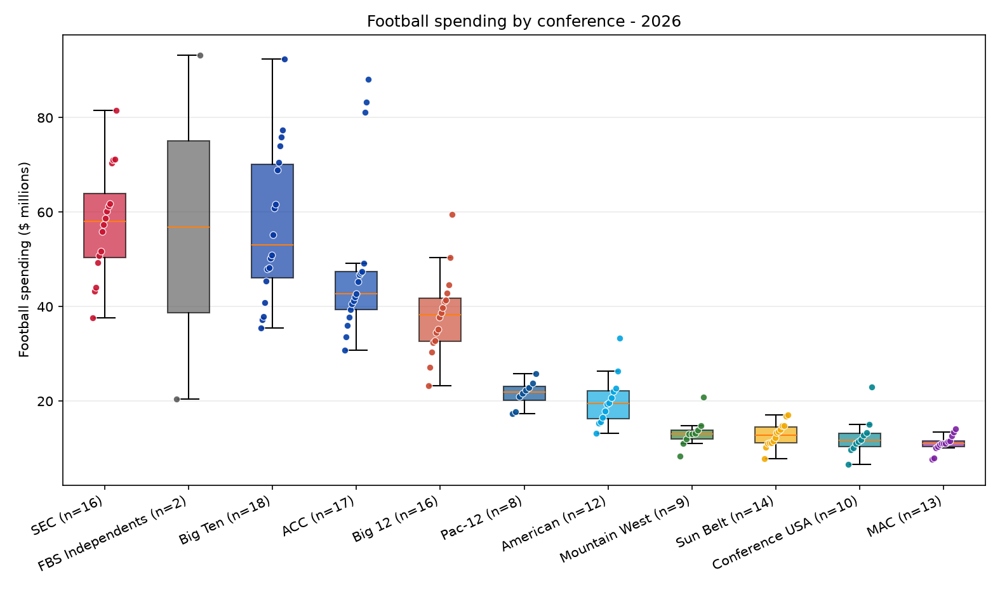

## Data sources

| Side | Source | Vintage |
| --- | --- | --- |
| Results, scores, stats | ESPN public API | live, 2026 |
| Football revenue/expenses, department revenue, average coach salaries | US Dept of Education EADA filings | report year 2025 |
| Head coach total pay | hand-compiled, per-row citations | 2026 |
| Revenue-share cap, roster payroll, team talent | House settlement reporting, 247Sports | 2026 |

> [!NOTE]
> Federal athletics finances are published on a lag, so the 2025 filings (academic year 2024-25) are the newest available. That is a feature here rather than a bug: past spending is a *leading* indicator of present results, so the direction of causation runs the right way.

## Caveats worth repeating

- **Public vs. private accounting**: EADA filings are self-reported, and many private schools book revenue to exactly equal expenses.
- **Reverse causation**: Football revenue partly reflects winning (tickets, donations, playoff payouts), so correlations are bidirectional.
- **Unrecorded NIL & revenue-share splits**: The House cap is public, but per-school football allocations and third-party NIL collectives are private.
- **Realignment labels**: Fixed effects use each school's 2026 conference; conference games are matched from same-season membership.
